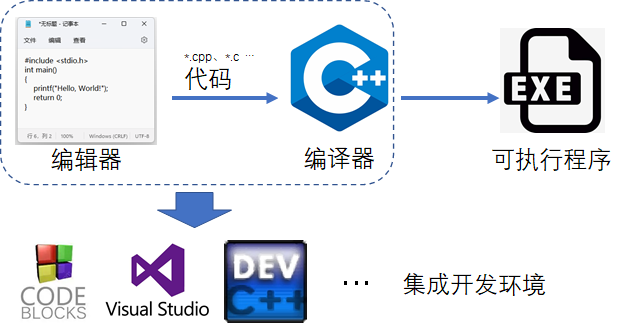
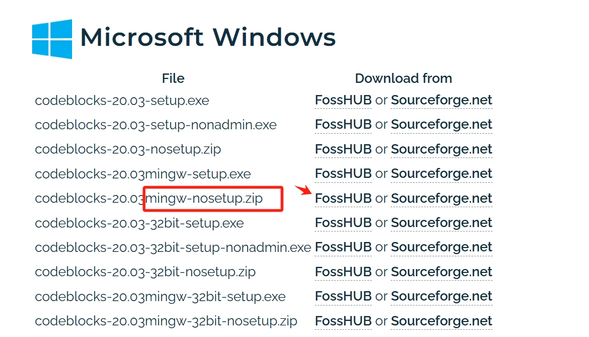
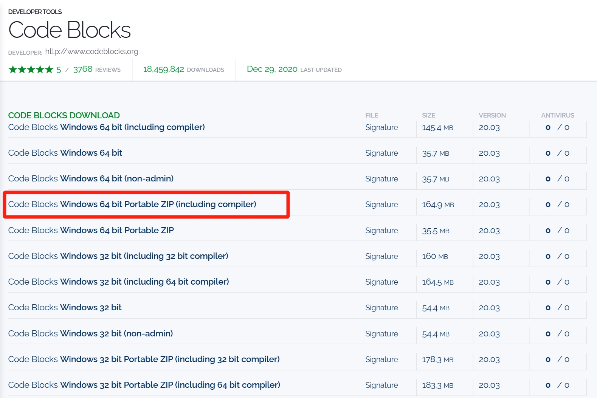
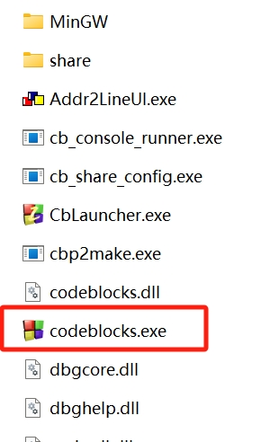
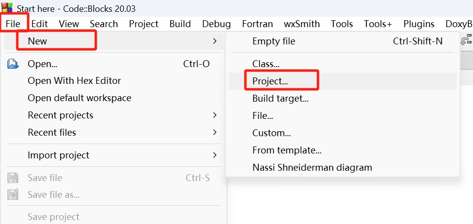
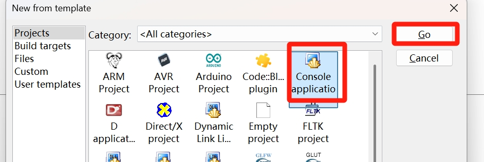
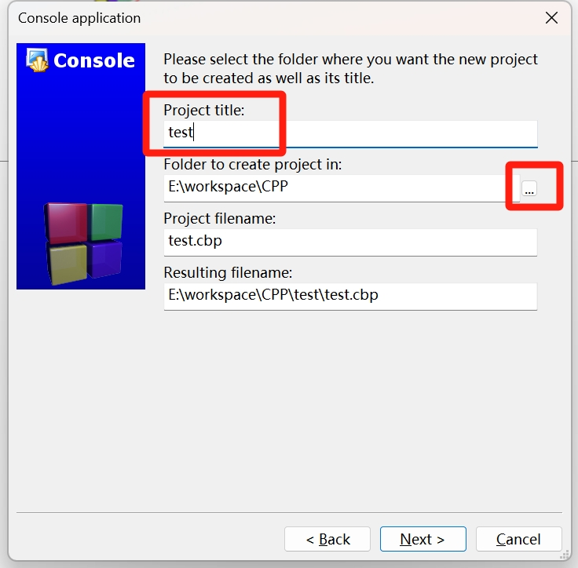
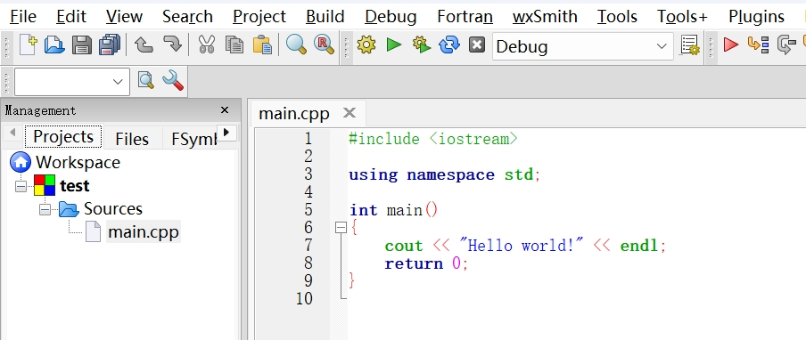
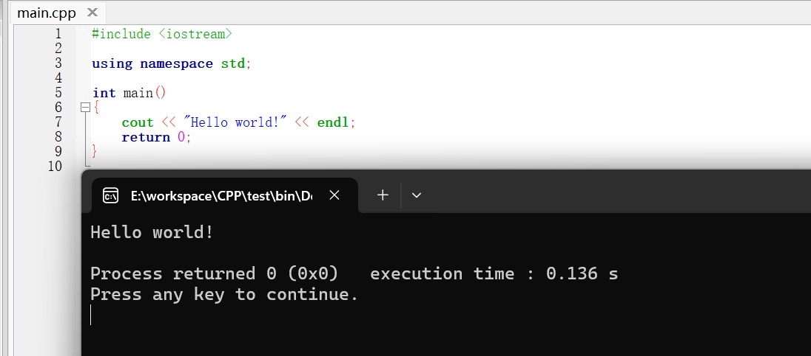

# 算法竞赛与编程

## 算法竞赛

### 什么是“程序”

让电脑按部就班做一系列事情的一个打包好的东西，在windows系统里我们通常称为“文件”，大家最熟悉的就是“.exe”文件，QQ的启动程序是，游戏的启动程序也是，双击它，电脑就开始做它所定义的事情。

我们通常用的程序都是有“界面”的程序，打开它，总能看到点什么。不过程序并不是必须有界面的，比如在windows里打开“任务管理器”，能看到很多正在运行的不知道在做什么的程序，它们就没有看得见的界面，但都在有条不紊地执行着系统需要的任务。


### 什么是编程

编程就是要制作可以执行的程序。

用一系列指令告诉计算机要做什么。这种指令从最早的机械开关，到纸带打孔，到“`010110`”的二进制输入，到指令分类并起名的汇编，再到C语言、C++、Java、Python编程语言的百花齐放。

加减乘除是人类易于理解的最基础的计算，计算机在指令中通过“`0`”与“`1`”的变化来模拟这些过程，进而可以做更复杂的事情：

- 比如把颜色编码为数字，实现画面的显示，得到软件的界面
- 比如把文字编码为数字，实现消息的传输
- 比如用数字做矩阵运算，用矩阵运算得到三维形状的模拟，实现3D引擎，做出3D游戏
- ……

#### 编辑器

当我们在文本编辑器中写下 

```cpp
int a = 1, b = 2; 
printf("%d\n", a + b);
```

是想告诉电脑，我定义了两个变量“`a`”和“`b`”，并且让`a`的值是`1`，`b`的值是`2`，然后队屏幕输出`a+b`的结果。这样就写出了一个简单的 C 语言代码片段。

凡是能用键盘敲字进去的地方都可以称为“编**辑**器”。

#### 编译器

但想让电脑真正执行这套指令，需要给的是电脑唯一能看懂的东西：“`01101001...`”这样的二进制内容，这时需要用到“编**译**器”。

编译器也是一种可执行程序，它不需要界面，充当“人看得懂的语言”到“电脑看得懂的指令”之间的翻译。通过“参数”的方式告诉它把什么翻译成什么，就可以完成这一过程。

```
g++ main.cpp -o main.exe
```

这里`g++`就是一个编译器的可执行程序（如果系统里安装了mingw，你能看到一个`g++.exe`文件，就是在执行它），而`main.cpp`和`-o`、`main.exe`就是参数。

#### 集成开发环境

作为一个没学过编程的新手，看到上面的内容已经开始头大了，能不能不要管什么编辑器、编译器、执行、参数，我就想写代码，然后跑起来。

可以的，这就是集成开发环境（integrated development environment，IDE），在一个有界面的软件里，集成了编辑器、编译器，且把编译、执行所需的一套指令打包在了快捷键里，就想打游戏时候所谓的“金手指”、“按键精灵”，让你“一键连招”。




### 什么是算法

学了小学数学，你可以轻松计算加减乘除，解二元一次方程，基本的面积计算等等。而圆锥曲线方程、柯西不等式、微积分、立体几何……就需要更高阶的知识。

学会编程，当你想让电脑计算加减乘除、矩阵运算、显示界面、传递数据等事情的时候，按部就班地去做就可以了。而这时如果有图像标注（哈希、BFS）、事务审批（有穷自动机）、进销存管理（线性规划）等需求，就束手无策了。

聪明的你或许此时已经感受到了知识之间的联系，数学虽不外乎加减乘除乘方开方，但许多事情仍无法用初等数学直接解决。电脑的`01`逻辑不外乎“与/或/非/与非”，但若没有高阶的数据处理技巧，许多事情仍然会一筹莫展。

将“编程”中的基本操作以不同的方式结合，有效解决具体的问题的方案，就是“算法”。


### 什么是算法竞赛

将工业界、生活中的具体问题，抽象为能用数据表达的模型，设计算法，编写程序高效地解决它们的比赛。

具体地，会给出问题的描述，具体的输入数据的形式、取值范围，输出的要求。

将程序提交至系统，系统会编译运行这个程序，然后将一系列选手看不到的输入数据输入至程序。

获取程序的输出，与答案比对，判断程序是否完成任务。

此外会限制程序执行时长、所使用的内存大小。

主流算法竞赛主要有两类赛制

#### ACM赛制

一个题目所有数据的答案全部正确视为题目通过，通过时距离比赛开始的时间作为“罚时”，错一次则额外计 20 的罚时，排名按通过题目个数为第一优先级，总罚时为第二优先级。

#### IOI赛制

每道题有分数，与解题时间、通过数据组数有关，得到一个综合分数，最后比较总分。


### 官方认定赛事类

#### ACM-ICPC

国际大学生程序设计竞赛（International Collegiate Programming Contest，ICPC）由 ICPC 基金会（ICPC Foundation）主办，始于1970年，是全球历史最悠久、规模最大且最负盛名、最具影响力的大学生计算机竞赛。由于该竞赛由国际计算机学会（Association for Computing Machinery，ACM）发起，也有很多人习惯叫它 ACM 竞赛。竞赛提倡创新和团队协作，鼓励学生在构建全新的软件程序时尽情发挥创意，帮助学生检验自在强压力下的工作能力。是世界各地计算机程序设计者大显身手的舞台，也是世界一流大学展现教育成果的最佳窗口。

由于比赛受限于场地及设备数量、服务器压力，ICPC在全球各大洲进行区域赛（Regional），各赛区每年也会设置多个赛站以实现人员分流。每年选拔约120支队伍参加世界总决赛（World Final）。我国高校参加亚洲区域赛，每年国内仅有不超过20所高校能够获得世界总决赛资格，通常将亚洲区域赛（Asia Regional）级别认定为国际级，而世界总决赛（World Final）参赛资格这一至高殊荣额外单列。

中国大陆目前有6个亚洲区域赛赛区（赛站），每支队伍每赛季最多可以正式队伍身份参加 2 场区域赛，以队伍排名计金银铜奖，以每个学校正式队伍排名最高的队伍计算学校排名。每年晋级总决赛规则不尽相同，大致而言所有赛区综合排名在国内18名以内的高校有极大希望进入总决赛，即单个赛区的学校排名进入前四会有较大概率。

- 官方全称：国际大学生程序设计竞赛
- 简称：ICPC（即 ACM-ICPC）
- 举办时间：每年下半年，各赛站分别进行
- 主办方：ICPC 基金会 
- 创始机构：国际计算机学会（Association for Computing Machinery, ACM）
- 目前国内ICPC信息总站：http://icpc.pku.edu.cn/index.htm
- ICPC官方网站：https://icpc.global/

<iframe src="//player.bilibili.com/player.html?isOutside=true&aid=808188965&bvid=BV1y34y1B7PQ&cid=484846892&p=1" scrolling="no" border="0" frameborder="no" framespacing="0" allowfullscreen="true"></iframe>

【ICPC世界总决赛莫斯科站的回忆】 https://www.bilibili.com/video/BV1y34y1B7PQ/?share_source=copy_web&vd_source=c617b7e2cc89265d6f82e07b3c66bc6c

#### CCPC

中国大学生程序设计竞赛（China Collegiate Programming Contest，CCPC）与ICPC赛制一致，每年也有多个赛站，各赛站优秀的队伍能够获得资格参加决赛，一般而言各赛站与决赛为同等级的国家级竞赛，是国内主办的最高级别算法竞赛。

- 官方全称：中国大学生程序设计竞赛
- 简称：CCPC
- 举办时间：每年下半年，各赛站分别进行
- 主办方：中国大学生程序设计竞赛组委会
- CCPC官方网站：https://ccpc.io/

<iframe src="//player.bilibili.com/player.html?isOutside=true&aid=706271009&bvid=BV18Q4y147tZ&cid=1343604196&p=1" scrolling="no" border="0" frameborder="no" framespacing="0" allowfullscreen="true"></iframe>

【CCPC2023深圳-混剪】 https://www.bilibili.com/video/BV18Q4y147tZ/?share_source=copy_web&vd_source=c617b7e2cc89265d6f82e07b3c66bc6c

<iframe src="//player.bilibili.com/player.html?isOutside=true&aid=578432468&bvid=BV1oz4y1w7tB&cid=1332784644&p=1" scrolling="no" border="0" frameborder="no" framespacing="0" allowfullscreen="true"></iframe>

【CCPC2023深圳-滚榜及颁奖】 https://www.bilibili.com/video/BV1oz4y1w7tB/?share_source=copy_web&vd_source=c617b7e2cc89265d6f82e07b3c66bc6c

<iframe src="//player.bilibili.com/player.html?isOutside=true&aid=280917548&bvid=BV1Xc411X7AH&cid=1332043703&p=1" scrolling="no" border="0" frameborder="no" framespacing="0" allowfullscreen="true"></iframe>

【CCPC2023深圳-正赛5小时全程直播回放】 https://www.bilibili.com/video/BV1Xc411X7AH/?share_source=copy_web&vd_source=c617b7e2cc89265d6f82e07b3c66bc6c


#### GDCPC

广东省大学生程序设计竞赛（Guangdong Collegiate Programming Contest，GDCPC）旨在将中国大学生程序设计竞赛（CCPC）引入广东省校园，提高广东省学生学习程序设计的兴趣和能力，推动广东省大学计算机课程的教学改革，为计算机程序设计方面有特长的同学提供展示才能的舞台。同时也可为各高校选拔、培训参加CCPC 的队员、为加强广东省内各高校之间的交流和相互学习提供了机会。从2019年开始，中国大学生程序设计竞赛 （CCPC）挂靠教育部计算机类教学指导委员会，经向 CCPC 组委会申请，广东省大学生程序设计竞赛隶属于CCPC，也称为 CCPC 广东省赛，其参赛报名将归入 CCPC。赛事由广东省计算机学会主办，广东省计算机学会普及工作委员会（广东省大学生程序设计竞赛的指导委员会）承办。

- 官方全称：广东省大学生程序设计竞赛
- 简称：GDCPC
- 举办时间：每年5-6月
- 主办方：广东省计算机学会
- GDCPC官方网站：http://www.gdcpc.cn/

<iframe src="//player.bilibili.com/player.html?isOutside=true&aid=229753412&bvid=BV14h411T7PW&cid=1164443946&p=1" scrolling="no" border="0" frameborder="no" framespacing="0" allowfullscreen="true"></iframe>

【气球飘扬的赛场——第二十届广东省大学生程序设计竞赛（GDCPC）暨中国大学生程序设计竞赛(CCPC)广东省赛】 https://www.bilibili.com/video/BV14h411T7PW/?share_source=copy_web&vd_source=c617b7e2cc89265d6f82e07b3c66bc6c

#### 百度之星

百度之星是百度公司发起并主办的一项面向全球高校学生和编程爱好者的程序设计竞赛。自举办以来，它已成为计算机领域备受瞩目的赛事，吸引了众多编程高手参与，在推动计算机技术发展和人才培养方面发挥着重要作用。

大赛以提升全球程序员的算法设计与编程实践能力为目标，致力于挖掘和培养计算机领域的优秀人才。比赛内容紧密围绕算法设计、编程实现以及问题解决能力，通过一系列具有挑战性的编程题目，考察选手对数据结构、算法知识的掌握程度，以及灵活运用这些知识解决实际问题的能力。

大赛一般包含多个阶段，初赛通常采用线上编程的形式，选手需在规定时间内完成一系列算法题目，系统自动评判代码的正确性和运行效率，根据成绩排名筛选出晋级复赛的选手。复赛的难度进一步提升，对选手的编程技巧、思维敏捷度以及在复杂问题面前的应变能力提出更高要求。最终脱颖而出的选手将获得参加现场总决赛的资格，在总决赛中，选手们现场同场竞技，气氛紧张而激烈，最终角逐出大赛的各个奖项。

- 官方全称：百度之星·程序设计大赛
- 简称：百度之星
- 举办时间：每年举办，具体时间根据当年赛事安排而定
- 主办方：百度公司
- 建议认定：在计算机编程竞赛领域，具有较高认可度，影响力覆盖全球高校及编程爱好者群体
- 官方网站：https://star.baidu.com/ （具体以实际官网为准） 

#### CCF-CCSP

CCF大学生计算机系统与程序设计竞赛（CCF Collegiate Computer Systems & Programming Contest, CCSP），由中国计算机学会(CCF)于2016年发起的一个面向大学生的竞赛，每年举办一次，考察的是算法、编程以及计算机系统设计能力，赛制接近OI，旨在进一步提高计算机教育质量，使学生通过竞赛进一步学习和掌握计算机系统知识，同时对高校计算机教育产生引领作用。

CCSP需要以有近四次的一次CCF-CSP认证的较好成绩为前提才能参加。比赛分为全国赛与全国分赛，同时进行，全国赛在承办高校进行，分赛在全国各高校组织，比全国赛减少部分困难题目。

- 官方全称：CCF大学生计算机系统与程序设计竞赛
- 简称：CCSP
- 举办时间：每年10-11月
- 主办方：中国计算机学会（China Computer Federation, CCF）
- CCSP官方网站：https://www.ccf.org.cn/ccsp/

#### RoboCom-CAIP

RoboCom机器人开发者大赛-CAIP编程设计赛道由工业和信息化部人才交流中心、RoboCom国际公开赛组委会举办，旨在提升大学生利用计算机分析问题、解决问题的重要基础能力。竞赛时长为 2 小时。竞赛中分为 2 个不同组别（高职组、本科组）使用不同题目，在同一时间按照统一评分规则进行比赛，研究生学历的参赛选手可选择本科组进行参赛。省级选拔赛评分：同一省内的参赛选手首先根据总得分进行排名。在确定其获得奖项时，如果总得分相同，则根据最高得分所提交的时间进行排名，时间短者排名居前；若扔有并列，则获得并列名次。决赛评分：参赛选手首先根据总得分进行排名。在决定获得奖项时，如果总得分相同，则根据最高得分所提交的时间进行排名，时间短者排名居前；若扔有并列，则获得并列名次。 

- 官方全称：RoboCom机器人开发者大赛 - CAIP编程设计赛道
- 简称：CAIP
- 举办时间：每年7-8月
- 主办方：工业和信息化部人才交流中心
- RoboCom官方网站：https://www.robocom.com.cn/

#### GPLT

团体程序设计天梯赛（Group Programming Ladder Tournament, GPLT）是中国高校计算机大赛（China Collegiate Computing Contest, CCCC）的竞赛版块之一，旨在提升学生计算机问题求解水平，增强学生程序设计能力，培养团队合作精神，提高大学生的综合素质，同时丰富校园学术气氛，促进校际交流，提高全国高校的程序设计教学水平。比赛重点考查参赛队伍的基础程序设计能力、数据结构与算法应用能力，并通过团体成绩体现高校在程序设计教学方面的整体水平。竞赛题目均为在线编程题，由搭建在网易服务器上的PAT在线裁判系统自动评判。难度分3个梯级：基础级、进阶级、登顶级。以个人独立竞技、团体计分的方式进行排名。

- 官方全称：中国高校计算机大赛 - 团体程序天梯赛
- 简称：GPLT
- 举办时间：每年4-5月
- 主办方：全国高等学校计算机教育研究会
- 赛事官网：https://gplt.patest.cn/

#### 蓝桥杯大赛

蓝桥杯全国软件和信息技术专业人才大赛（简称“蓝桥杯”）由中华人民共和国工业和信息化部人才交流中心主办， 旨在推动软件和信息技术产业的发展，促进软件和信息技术专业技术人才培养，向软件和信息技术行业输送具有创新能力和实践能力的高端人才，提升高校毕业生的就业竞争力，全面推动行业发展及人才培养进程的全国性竞赛。赛制接近OI，比赛分为省赛和国赛部分，省赛一等奖选手可以晋级国赛。

- 官方全称：蓝桥杯全国软件和信息技术专业人才大赛
- 简称：蓝桥杯大赛
- 举办时间：每年4-6月，4月省赛，6月国赛。
- 主办方：中华人民共和国工业和信息化部人才交流中心
- 蓝桥杯官方网站：https://dasai.lanqiao.cn/


### “民间”赛事类

#### CodeForces

CodeForces很大的特点就是题目兼容并蓄，什么难度等级的题目都可以找到。并且题目很有意思，思维题比较多。

CodeForces另外一个很大的特点就是它有自己的上分系统，基本上每周会举办一到两次在线的算法比赛。一般的比赛时长是两个小时，只要注册账号就可以免费参加。由于参加的选手水平实力强度不一，所以它开设了好几个档次(Div)，不同层次的选手面对的题目难度也不一样，这样保证了大家都可以愉快地参赛。大约一周一次，时长2小时。

- 官方全称：CodeForces
- 简称：CodeForces
- 举办时间：大约一周举办一到两次，每次时长2小时
- 主办方：无明确提及
- 官方网站：https://codeforces.com/

#### Atcoder

AtCoder是日本最大的算法竞技网站，也是全球第二流行的算法竞技网站。与Codeforces不同的是，AtCoder代码提交后没有预测试，参赛者提交程序后即可知道自己的程序是否正确。AtCoder的比赛有四大类：
1. AtCoder Beginner Contest（ABC），主要面向算法初学者。每周六或周日20点举行，时长100分钟。通常是8道题，AtCoder积分在0~1999区间的选手参与这种比赛，积分会根据做题结果而涨或跌。
2. AtCoder Regular Contest （ARC），主要面向有一定算法基础的选手。举办频率低于AtCoder Beginner Conste，对标Codeforces Div2。
3. AtCoder Grand Contest（AGC），主要面向较高水平的选手，每两个月左右举办一次。
4. 除ABC、ARC、AGC以外的非常规比赛，比如日本企业赞助的比赛，面向招聘的比赛，算法马拉松比赛。

- 官方全称：AtCoder
- 简称：AtCoder
- 举办时间：ABC每周六或周日20点举行，时长100分钟；ARC举办频率低于ABC；AGC每两个月左右举办一次；非常规比赛依具体安排
- 主办方：无明确提及
- 官方网站：https://atcoder.jp/

## 开启编程之旅

### 下载安装一个IDE

不少大学基础课会使用 Visual Studio，可能是因为有中文界面、简单易上手、大多机房都会安装的缘故。但入门编程，特别是对算法竞赛感兴趣的新手，非常不推荐使用 Visual Studio，主要在于其编译机制不完全符合C/C++标准，与评测机的不一致会导致一个新手常见问题：“本地跑的好好的，为什么提交就是不对呢”。

日常编程而言，更推荐 Visual Studio Code 或 Jetbrains 的 Clion。不过为了轻量、简单、易上手，这里以 Codeblocks 为例开始编程之旅。

在这里下载：https://www.codeblocks.org/downloads/binaries/

注意选择“mingw-nosetup.zip”这个版本






如果官网下载不太顺利，可以从这个网盘链接下载：

https://share.weiyun.com/QMLclZWZ

解压到任意目录即可，最好**路径上不要有中文**，比如“`E:/IDE/CodeBlocks`” 就可以。

双击打开它



第一次打开会有一些弹窗，默认下一步就好

点击“File”，选择“New->Project”



新建“Console Application”



各选项都按默认下一步，然后选择一个只有字母数字下划线的路径（中文系统里有各种中文文件夹，避免路径带中文或空格， 这个软件不兼容这样的路径），起一个纯字母的名称



在左侧打开“main.cpp”，就可以看到一个“Hello World”程序了



按下键盘的“F9”试一下，应该**编译**并**运行**出一个黑框框（命令行）



## 应当熟悉的其他工具

### git与版本控制：养成整理备份的好习惯


git（分布式版本控制系统）并不等同于github。

git是一个分布式版本控制软件，最初由林纳斯·托瓦兹创作，于2005年以GPL发布。

github提供git服务，其他网站当然也可以，自己也可以搭建git服务器。

今天改了代码，明天又改了，后天甲方爸爸说还是喜欢第一个版本……

用git可以方便的查看/回滚任意commit过的版本，并查看文本类文件的差异。

当然也可以当个文档云服务，方便地在不同地点同步自己的代码与文档。严格的版本控制能够保证文件不出差错。

推荐使用git管理自己的ACM代码、解题报告、模板、技术日志等。

