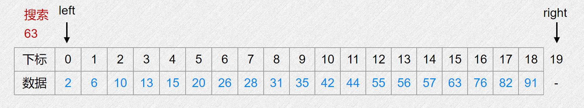
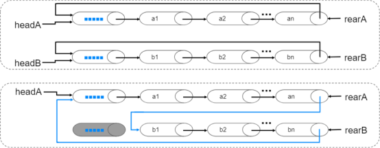

# 线性表

## 线性表的顺序存储

### 顺序表基本操作

**逻辑上相邻的数据，存储在物理上相邻的存储单元**

不同变量类型可能占据不同大小的内存，比如`char`占 $1$ 字节，`int` 占 $4$ 字节，下表用 $b$ 表示数组 $a$ 的起始地址， $L$表示数组单个元素占内存大小。

| 存储地址：  | b  | b+L | ... | b+(i-1)L | ... | b+(n-1)L | b+nL | ... | b+(maxlen-1)L |   |
|--------|----|-----|-----|----------|-----|----------|------|-----|---------------|---|
| 内存状态：  | a[0] | a[1]  | ... | a[i]       | ... | a[n]       |      |     |               |   |
| 线性表位序： | 0  | 1   | ... | i        | ... | n        | 空闲地址 |     |               |   |

基本操作

- 单个增加
- 单个插入
- 单个缩短
- 单个删除
- 批量增加
- 批量插入
- 定长缩短
- 批量删除
- 特定值存在性判断
- 元素非重复式插入
- 无序表非重复合并
- 有序表合并

单个插入示例

| 下标  | 0  | 1  | 2  | 3    | 4  | 5  | 6  | 7  | 8 |
|-----|----|----|----|------|----|----|----|----|---|
| 数值  | 12 | 32 | 50 | 17   | 18 | 30 | 27 |    |   |
|     |    |    |    | 插入33 |    |    |    |    |   |
| 插入后 | 12 | 32 | 50 | 33   | 17 | 18 | 30 | 27 |   |


```cpp
const int MAXLEN=100;   // 要求至多存100个元素
int a[110], len;
int Insert(int a[], int x, int &len, int ith) {
    // 将x插入坐标ith，超过表限制长度则报错，并维护表长度
    if(len == MAXLEN) {
        return -1;          // 假设-1为报错信号
    }
    for(int i = len; i > ith; i --) {
        a[i] = a[i - 1];    // 把ith位置之后的元素向后挪
    }
    a[ith] = x;             // ith位置已空出，放入x
    len ++;                 // 维护元素个数
    return 0;
}
int main() {
    len = 0;    // 最初没有元素
    Insert(a, 3, len, 0);
    Insert(a, 1, len, 1);
    Insert(a, 5, len, 2);
    Insert(a, 8, len, 1);
    for(int i = 0; i < len; i ++) {
        printf("%d ", a[i]);
    }
    printf("\n");
    // 查看输出是否为 3 8 1 5 
    return 0;
}
```

批量删除示例，按左闭右开区间 $[s, e)$进行批量删除

| 下标  | 0  | 1  | 2  | 3  | 4  | 5  | 6  | 7 | 8 |
|-----|----|----|----|----|----|----|----|---|---|
| 数值  | 12 | 32 | 50 | 17 | 18 | 30 | 27 |   |   |
|     |    |    |    | s  |    | e  |    |   |   |
| 插入后 | 12 | 32 | 50 | 30 | 27 |    |    |   |   |


```cpp
const int MAXLEN=100;   // 要求至多存100个元素
int a[110], len;
int DelRange(int a[], int x, int &len, int s, int e) {
    // 删除 [s, e) 左闭右开区间内的元素，也就是把 e 之后所有元素平移到 s
    int i = s, j = min(len, e);
    for(; j < len; i ++, j ++) {
        a[i] = j;
    }
    len = i;    // 平移结束时，i 指向的就是最后一个元素的下一个位置
    return 0;
}
```

### STL：用vector作为顺序表

C++的STL提供了vector容器，可以更灵活动态地创建顺序表并使用内置的功能。

```cpp
#include<cstdio>
#include<vector>
int main() {
    std::vector<int> a(10);         // 初始化一个长为10的vector
    printf("%lu\n", a.size());
    // 上句输出 10
    std::vector<int> b(5, 3);       // 初始化一个长为5，所有值为3的vector
    // 用传统循环遍历
    for(int i = 0; i < b.size(); i ++) {
        printf("%d ", b[i]);
    }
    // 上句输出 3 3 3 3 3
    printf("\n");
    b.insert(b.begin() + 3, 999);   // 在下标 3 位置插入 999
    // 用迭代器 iterator 遍历
    for(std::vector<int>::iterator it = b.begin(); it != b.end(); it ++) {
        printf("%d ", *it);
    }
    // 上句输出 3 3 3 999 3 3
    printf("\n");
    b.push_back(666);               // 在末尾插入 666
    // 用C++11开始支持的“auto”遍历
    for(auto x : b) {
        printf("%d ", x);
    }
    // 上句输出 3 3 3 999 3 3 666
    printf("\n");
    b.resize(200);                  // 大小改为200，扩展出的数值未定义
    printf("%lu\n", b.size());
    // 上句输出 200
    return 0;
}
```

vector更多丰富功能可参考[CPP官方文档](https://zh.cppreference.com/w/cpp/container/vector)

### 二分查找

在一个已经从小到大有序的数组中查找特定数值的位置，可以有比一遍循环挨个查看更快的方法.

猜数小游戏：想一个 $1000$以内的整数，让朋友猜，只提示高了还是低了. 显而易见的策略是先猜 $500$，如果低了那么下一次就猜 $750$，如果高了就猜 $250$，很快（大约 $10$ 次）就能得到答案.

在有序数组上的二分查找就是这个道理，可以快速判断特定数值是否在数组中存在，以及在哪个位置.



上图对应这样一份二分查找代码：

```cpp
int a[100], length; // 有序
int BiSearch(int num, int a[], int alen) {
    // left right 标识左闭右开区间
    // 即 left 指向首元素，right指向末元素的下一个位置
    int left = 0, right = alen;
    while(left < right - 1) {
        // left与right的中间位置，这里右移运算与除以2等价
        int mid = left + right >> 1;
        if(a[mid] <= num) left = mid;
        else right = mid; // right 保持考察区间右侧开区间，这里已排除mid
    }
    // left 的位置是搜索结果
    return a[left] == num ? left : -1;
}
```

当有序数组中有重复元素时，需求可能会分为 Lower Bound 和 Upper Bound，他们的定义是：

- **Lower Bound**：对于给定的元素 $x$，不小于 $x$ 的第一个元素的位置
- **Upper Bound**：对于给定的元素 $x$，大于 $x$的第一个元素的位置

参考代码：

```cpp
int LowerBound(int a[], int n, int x) {
    // 在元素个数为 n 的有序数组 a[] 中查找 x 的 Lower Bound
    int left = 0, right = n, mid;
    while(left < right) {
        mid = (left + right) / 2;
        if(a[mid] >= x) right = mid;
        else left = mid + 1;
    }
    return left == n ? -1 : left;
}
int UpperBound(int a[], int n, int x) {
    // 在元素个数为 n 的有序数组 a[] 中查找 x 的 Upper Bound
    int left = 0, right = n, mid;
    while(left < right) {
        mid = (left + right) / 2;
        if(a[mid] > x) right = mid;
        else left = mid + 1;
    }
    return left == n ? -1 : left;
}
```

会发现 LowerBound 与 UpperBound 有微妙的区别，为了加深理解，可以自己设计一个有重复元素的有序数组，模拟一下过程，或者用调试的方式单步执行。

二分查找的写法并不唯一，比如前面动图的代码和后面的 Lower Bound 写法就有区别，新手很容易在处理边界时困惑或出错，比如 `if(a[mid] > x)`还是`if(a[mid] >= x)`？为什么 `right = mid` 而 `left = mid + 1`？循环条件是 `left < right` 还是 `left <= right` ？

在手动模拟过程理解一份正确的二分查找代码后，**把它背下来**，可以减少未来可能的出错。

接下来也给出使用`vector`和`stl`内置的实现方法，一些`stl`使用细节不明白的地方可以先跳过或查询资料，当以后熟练了再回来看。

```cpp
int LowerBound(std::vector<int>& a, int x) {
    auto it = std::lower_bound(a.begin(), a.end(), x);
    return it == a.end() ? -1 : it - a.begin();
}

int UpperBound(std::vector<int>& a, int x) {
    auto it = std::upper_bound(a.begin(), a.end(), x);
    return it == a.end() ? -1 : it - a.begin();
}
```

## 线性表的链式存储


### 单链表


逻辑上相邻的数据元素在物理上不一定相邻

|   |    |      |     |      |    |  ⬇头指针   |       |      |
|-------|----|------|-----|------|----|------|-------|------|
| 存储地址： | 1  | 7    | 13  | 19   | 25 | 31   | 37    | 43   |
| 数据域：  | LI | QIAN | SUN | WANG | WU | ZHAO | ZHENG | ZHOU |
| 指针域：  | 43 | 13   | 1   | NULL | 37 | 7    | 19    | 25   |


基本定义

```cpp
#include<cstdio>
struct Node {
    int val;    // 值
    Node *nex;  // 指针
};
void AddHead(Node *hp, int x) {
    // 将数 x 插入头节点为 head 的链表开头——头插法
    Node *p = new Node;
    p->val = x;
    p->nex = hp->nex;
    hp->nex = p;
}
void AddTail(Node *hp, int x) {
    // 将数 x 插入头节点为 head 的链表结尾——尾插法
    Node *p = new Node;
    Node *r;
    for(r = hp; r->nex != nullptr; r = r->nex);  // 找到链表末尾
    p->val = x;
    p->nex = r->nex;
    r->nex = p;
    
}
int main() {
    Node *head = new Node;  // 头节点
    head->nex = nullptr;
    AddHead(head, 1);
    AddHead(head, 3);
    AddTail(head, 4);
    for(Node *p = head->nex; p != nullptr; p = p->nex) {
        printf("%d ", p->val);
    }
    return 0;
}
```

基本操作

- 单个增加
- 单个插入
- 单个缩短
- 单个删除
- 批量增加
- 批量插入
- 定长缩短
- 批量删除
- 特定值存在性判断
- 元素非重复式插入
- 无序表非重复合并
- 有序表合并


思考：为什么要有不存数值的“头节点”？  

- 尝试分别用有无头节点的方式执行基本操作
- 考虑有无头节点情况下空表分别如何体现

思考：什么时候用顺序表，什么时候用链表？

- 顺序表方便随机存取：需要频繁读取第x个元素的任务
- 链表方便频繁增删：需要频繁增删部分元素的任务

### 单链表的静态实现

算法竞赛用固定可控的内存管理更不易出错，链表指针无非表达数据存储的位置，数组下标一样可以实现。

**推荐在比赛中用静态数组与下标的方式管理链式结构，尽量避免使用指针**。

```cpp
#include<cstdio>
struct Node {
    int val;
    int nex;    // 指针改为数组下标
};
Node lst[999];  // 提前开好足够题目使用的内存作为待用链表节点
int tp;         // 一个模拟内存控制的下标变量

int NewNode() {
    // 模拟新建一个节点，返回lst中的下标
    lst[tp].nex = -1;   // 用 -1 下标表达“空指针”的含义
    tp ++;              // 让 tp 指向下一个待使用的Node
    return tp - 1;      // tp刚刚++了，tp-1才是刚分配好的Node
}
void AddHead(int hp, int x) {
    // 将数 x 插入头节点下标为 hp 的链表开头——头插法
    int p = NewNode();
    lst[p].val = x;
    lst[p].nex = lst[hp].nex;
    lst[hp].nex = p;
}
void AddTail(int hp, int x) {
    // 将数 x 插入头节点为 head 的链表结尾——尾插法
    int p = NewNode(), r;
    for(r = hp; lst[r].nex != -1; r = lst[r].nex);  // 找到链表末尾
    lst[p].val = x;
    lst[p].nex = lst[r].nex;
    lst[r].nex = p;
    
}
int main() {
    tp = 0;     // 初始化节点分配下标为0
    int head = NewNode();
    AddHead(head, 1);
    AddHead(head, 3);
    AddTail(head, 4);
    for(int p = lst[head].nex; p != -1; p = lst[p].nex) {
        printf("%d ", lst[p].val);
    }
    return 0;
}
```

### 循环链表

给出一个单链表中间某个节点的指针，无法找到它之前的节点。

如果把链表首尾相连，让最后一个节点指向头节点，就可以从任何位置出发找到所有节点。


小练习：仅知道尾指针`rearA`与`rearB`的情况下合并两个循环链表为一个循环链表



尝试补全代码

```cpp
struct Node {
    int val;
    int nex;
};
Node lst[9999];
void Merge(int rearA, int rearB) {
    // lst[rearA]和lst[rearB]分别是两个循环链表最后节点
}
```

### 双向链表

```cpp
struct DNode {
    int val;
    int prior;  // 指向上一个节点
    int nex;    // 指向下一个节点
};
DNode lst[9999];
int tp = 0;
int NewNode() {
    // ...
}
```

尝试在 `p` 节点之前插入元素 `x`

```cpp
void DLInsert(int p, int x) {

}
```

尝试在删除`p`节点

```cpp
void DLDelete(int p) {

}
```

参考答案如下

```cpp
DLInsert(int p, int x) {
    int np = NewNode();
    lst[np].val = x;
    // 设定新节点 np 的前后下标
    lst[np].nex = p;
    lst[np].prior = lst[p].prior;
    // 更新 p 之前节点的后下标
    lst[lst[p].prior].nex = np;
    // 更新 p 节点的前下标
    lst[p].prior = np;
}
DLDelete(int p) {
    // 更新 p 之前节点的后下标
    lst[lst[p].prior].nex = lst[p].nex;
    lst[lst[p].nex].prior = lst[p].prior;
}
```


### 小练习：一元多项式

稠密一元多项式：各项指数相差不大

$P(x)=10+5x-4x^{2}+3x^{3}+2x^{4}$

用顺序表表达

| 指数  x    | 0  | 1 | 2  | 3 | 4 |
|----------|----|---|----|---|---|
| 系数  p[x] | 10 | 5 | -4 | 3 | 2 |

```cpp
int p[999];
int main() {
    int n;
    scanf("%d", &n);                // n项
    for(int i = 0; i < n; i ++) {
        scanf("%d", &p[i])          // 读取 0~n-1各项系数
    }
    return 0;
}
```

稀疏一元多项式：指数差别很大，比如 $2x^{1352412369}+x^{1000000000}$

用链表表达

```cpp
struct Node {
    int c;      // 系数
    int e;      // 指数
    int nex;    // 链表下一个节点下标
};
Node lst[9999];
int tp;
int NewNode() {
    // ...
}
void AddTail(int hp, int c, int e) {
    // TODO
}
int main() {
    int n, e;
    tp = 0;
    int head = NewNode();
    scanf("%d", &n);                // n项，但指数不保证连续
    for(int i = 0; i < n; i ++) {
        scanf("%d%d", &c, &e);      // 输入保证 e 从小到大递增
        int p = NewNode();
        lst[p].c = c;
        lst[p].e = e;
        AddTail(head, c, e);
    }
    return 0;
}
```

> 思考：两个这样的多项式相加如何计算和保存结果  
> 提示：因为 e 递增，可以两个游标分别对应两个链表异步对齐前进，新结果插入到新链表中
