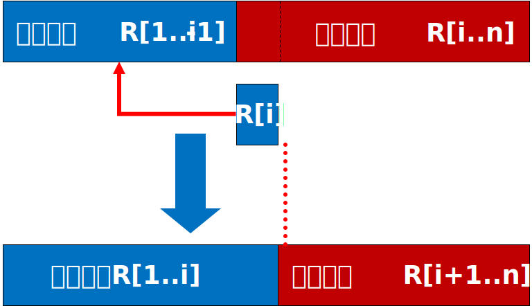
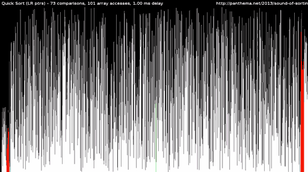
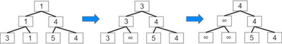

# 排序

## 排序的概念

将无序数据变为有序，不明确指定顺序的情况下默认从小到大排序。

排序需要具体的方案来实现，不同的方案执行效率不同，通常用元素的“比较次数”与“移动次数”作为执行的代价来衡量不同排序算法的效率。

综合评价一个排序算法有以下三个要素：

- 时间复杂度：元素的比较次数与移动次数与数据规模 $n$ 关系，通常简化为大写字母 $O$与 $n$ 的多项式最高次幂去掉系数的形式表达，比如 $O(n^2)$、$O(nlog_{2}n)$等。
- 空间复杂度：一些排序算法需要利用额外的内存来完成，也用 $O$表达式表示，如果只用一两个或十几个`int`空间，通常称为空间复杂度 $O(1)$，如果额外内存规模接近 $n$ 且成正比，通常称为空间复杂度 $O(n)$。
- 稳定性：如果两个元素的关键数据相等，排序前与排序后这两元素的前后顺序总能保持不变，则这样的排序算法是“稳定”的；反之，如果排序后这两元素前后顺序可能变化，不能确保与排序前一致，就称为不稳定的。
    举个例子，一个学生的信息用结构体表达：
    ```cpp
    struct Student {
        int age, height, weight;
        char name[20];
    };
    Student s[1000];
    ```
    需要按身高排序，那么`height`就是关键数据，对 `s[1000]` 排序时，相同`height`的学生前后位置随意变化不影响排序的正确性，但是排序前与排序后他们的先后位置是否变化这一“稳定性”在有的应用场景是需要的，所以排序算法的稳定性是一个重要属性。

## 从插入排序到希尔排序

### 插入排序

插入排序在一个数组中从前往后对每个元素做处理，在“考察”元素 `a[i]` 时，实际上数组已经被分成两部分， $[0,i)$ 这部分是已经有序的部分（最开始考察 `a[0]`，它只有一个元素，当然也是有序的），$[i + 1, n)$ 这部分是后续要考察的。在有序的部分找出 `a[i]` 的 Lower Bound，将 `a[i]` 插入到这个位置之前，就让有序的部分增加了 $1$，直到$[0, n)$都有序。



已经学过有序数组中的二分查找，那么找到 `a[i]` 插入的位置可以用二分查找比`for`循环一个个找过去更快一些。

分析三要素：

- 时间复杂度：最坏情况每个元素都插入最前面，把已经有序的数据往后挪，$1+2+\dots +n-1 \approx O(n^2)$
- 空间复杂度：除了数组本身，额外空间只有一些辅助变量，并没有达到 $n$ 的级别，是 $O(1)$
- 稳定性：对于关键数据相等的元素，后考察的在先考察的后面，插入位置找 Lower Bound，能保证排序后相对关系不变，**稳定**

实现方式不唯一，查找和插入都可以用线性表章节练习时的方法实现，这里给一种参考：

```cpp
void Insertionsort(int a[], int n) {
    for(int i = 1; i < n; i ++) {
        int now = a[i], j;
        for(int j = i; j > 0 && a[j - 1] > now; j --) {
            a[j] = a[j - 1];    // 遇到不大于now的数之前，挨个往后挪一位
        }
        a[j] = now;             // 找到不大于now的位置，插入到该位置之后
    }
}
```

### 希尔排序

把数据按下标按固定间距分组，比如  $0,5,10,\dots$一组，$1,6,11,\dots$一组，$2,7,12,\dots$一组……各组可以分别做插入排序，然后缩小分组的固定间距再来一次，直到间距为 $1$时再来一次，完成排序。

这样排序带来效率提升的主要原因是，在普通插入排序中，每个数在插入正确的位置时需要一个一个地跳过在它前面比它大的数。

而希尔排序中通过有跨度的分组排序，可以让数据跳过很多移动步骤。

比如 $5,6,7,3,1$ 中，插入朴素插入排序需要让 $1$挨个跳过前面 $4$ 个数，而用希尔排序，把 $5,7,1$分成一组， $6,3$ 分成一组， $1$ 只需要跳过 $5$ 和 $7$ 两个数就到达的正确位置。

$n$ 个数希尔排序具体步骤是：

1. 以 $\lfloor n/2 \lfloor$ 为间距分组，分别进行插入排序
   比如 $3,5,2,4,6,1,7,8$ ，第一次分组就是 $3,6$ 一组（ $3$ 的下标是 $[0]$， $6$ 的下标是 $[4]$，间距为 $4$）， $5,1$ 一组， $2,7$ 一组， $4, 8$ 一组
2. 以 $\lfloor n/4 \lfloor$ 为间距分组，分别进行插入排序
3. 不断缩小分组间距，直到以 $1$ 为间距分组，此时只有一个组，包含所有数，进行最后一次插入排序

假设带有间距的插入排序 `InsertShort(int a[], int n, int start, int gap)` （`start`表示第几组，`gap`表示间距）已经实现，在希尔排序中调用它，希尔排序参考如下：

> 思考：分组个数与 `gap` 是什么关系？

```cpp
void ShellSort(int a[], int n) {
    for(int gap = n / 2; gap >= 1; gap /= 2) {
        for(int start = 0; start < gap; start ++) {
            InsertSort(a, n, start, gap);
        }
    }
}
```

分析三要素：

- 时间复杂度：希尔排序具体能省略多少移动，与数据分布和gap有关，经验来说复杂度在 $O(n^{1.25}) \sim O(1.6n^{1.25})$
- 空间复杂度：除了数组本身，额外空间只有一些辅助变量， $O(1)$
- 稳定性：分组分别插入排序的时候，某个组的数可能跳过了其它组与它相等的数，从而无法保证稳定，是 **不稳定** 排序

## 从冒泡排序到快速排序

### 冒泡排序

从头到尾挨个比较相邻的两个元素，如果前一个比后一个大，就交换两个的位置。

在这个过程中，最大的那个数肯定会被持续交换到结尾。

那么再来一轮，从头到尾挨个比较（不过最后那个位置已经是最大的数，就不用管它了），第二大的数肯定会交换到倒数第二个位置。

如此进行，就会将第三大、第四大的数一轮又一轮地推到后面，最后数组就有序了。

```cpp
void BubbleSort(int a[], int n) {
    for (int i = 0; i < n - 1; i ++) {          // 进行 n-1 轮
        for (int j = 0; j < n - i - 1; j ++) {  // 每多一轮，就可以少管末尾一个数
            if (a[j] > a[j + 1]) {              // 判断相邻两数是否要交换
                std::swap(a[j], a[j + 1]);
            }
        }
    }
}
```

分析三要素：

- 时间复杂度：两个循环，第二个循环（挨个比较）是个递减的等差数列， $O(n^2)$
- 空间复杂度：除了数组本身，额外空间只有一些辅助变量， $O(1)$
- 稳定性：相等的数不交换，能确保稳定

### 快速排序

也是基于交换的排序，但是比冒泡排序能够进行更高效的交换，基本思想：

取一个元素为中心，所有比它小的元素放它前面，比它大的放它后面。前后两部分分别递归地做相同的事。



参考代码：

```cpp
void QuickSort(int *a, int left, int right) {
    // left、right左闭右开，low、high闭区间
    if(left >= right - 1) return;   // 递归终点，只有一个元素
    
    int low = left;         // low 游标从待排序最左元素下标开始
    int high = right - 1;   // high 游标从待排序最右元素下标开始
    int center = a[low];    // 选最左元素作为中心，a[low]存到临时变量center中，此时 low 位置空了出来
    while(low < high) {
        // 从右边开始挨个往左看，不小于 center 就保持不动，否则停下
        while(low < high && a[high] >= center) high --;
        // 遇到了一个小于 center 的元素 a[high]，放到 low 指向的位置，此时 high 位置空了出来
        a[low] = a[high];
        // 从左边开始挨个往右看，不大于 center 就保持不动，否则停下
        while(low < high && a[low] <= center) low ++;
        // 遇到一个大于 center 的元素 a[low]，放到 low 指向的位置，此时 low 位置空了出来
        a[high] = a[low];
    }
    // while循环结束，low 与 high 相遇，该位置空了出来，把刚才拿出的 center 放回来
    a[low] = center;
    QuickSort(a, left, low);        // 递归处理左半边，区间 [left, low)
    QuickSort(a, low + 1, right);   // 递归处理右半边，区间 [low + 1, right)
}
```

分析三要素：

- 时间复杂度：此处不作详细分析，在理想情况下（或平均情况下） $O(nlogn)$
- 空间复杂度：递归存储开销， $O(logn)$
- 稳定性：用于划分的中心数字有一定随机性，无法保证稳定性，**不稳定**

最坏情况：选择划分数可能每次都在一端，退化为 $n^2$，可以每次在 $low, high, \lfloor (low + high) / 2 \rfloor$三者取中间数降低最坏情况概率。

## 从选择排序到堆排序

### 选择排序

- 在所有数中找出最小的数，与第一个位置的数交换
- 在剩下的数里选最小的数，与第二个位置的数交换
- 重复以上操作，直到不再剩下数

分析三要素：

- 时间复杂度：每次剩下的数是个等差数列， $O(n^2)$
- 空间复杂度：无额外开销， $O(n)$
- 稳定性：交换操作可能破坏部分数的前后关系，**不稳定**

一种优化——树形选择排序



像世界杯这样的锦标赛方式捉对pk来选出最小的数，已选出的数拿走后把锦标赛的这一步该数改为无穷大，重复这个赛区的“比赛”能得到新的最小的数。

### 堆排序

用一个二叉堆的数据结构在原数组空间中维护最小数，它可以在 $O(nlogn)$ 的一次初始化之后，每次在 $O(logn)$ 时间内维护堆结构（让各子堆的堆顶都是堆内的最小值）。

参考代码：

```cpp
void HeapAdjust(int a[], int s, int e) {
    for(int nex = s << 1; nex <= e; nex <<= 1) {
        if(nex + 1 <= e && a[nex + 1] < a[nex]) nex ++;
        if(a[s] <= a[nex]) break;
        Swap(a[s], a[nex]);
        s = nex;
    }
}

void HeapSort(int a[], int n) {
    for(int i = n >> 1; i; i --) HeapAdjust(a, i, n);
    for(int i = n; i > 1; i --) {
        Swap(a[i], a[1]);
        HeapAdjust(a, 1, i - 1);
    }
}
```

分析三要素：

- 时间复杂度：$O(nlogn)$
- 空间复杂度：无额外开销， $O(1)$
- 稳定性：**不稳定**


堆是一个很有意义的数据结构，未来会了解优先队列，有很多任务需要在一堆动态插入的数据中找最小，堆可以在 $O(logn)$时间内维护堆的性质的这一特性将非常有用，经典算法 Dijkstra、Prim等都会用到基于堆实现的优先级队列。

## 归并排序

在学过顺序表的归并操作之后，归并排序就不难理解了。

- 从左到右每 $2$ 个数归并一次
- 从左到右每 $4$ 个数的前 $2$ 个数与后 $2$ 个数归并一次
- 从左到右每 $8$ 个数的前 $4$ 个数与后 $4$ 个数归并一次
- 直到所有的数归并到了一起，全部有序

不过实现归并排序用递归的方式会更加方便，参考代码如下：

```cpp
int a[1100];
int mergeTemp[1100];
void MergeSort(char a[], int left, int right) {
    // [left, right) 是待排序的区间
    if(left >= right - 1) return;   // 递归终点，只有1个数
    int mid = left + right >> 1;    // 取中点，划分为左右两半
    MergeSort(a, left, mid);        // 递归地对左半边归并排序
    MergeSort(a, mid, right);       // 递归地对右半边归并排序
    // 以上两个递归执行完后，左右两半边分别有序，接下来把两半边归并到一起
    int i, j, k;
    for(i = k = left, j = mid; i < mid && j < right; )
    mergeTemp[k ++] = a[i] <= a[j] ? a[i ++] : a[j ++];
    while(i < mid) mergeTemp[k ++] = a[i ++];
    while(j < right) mergeTemp[k ++] = a[j ++];
    // 完成了[left, right)的排序，但用到了临时数组，把它拷贝回原数组这个区间
    memcpy(a + left, mergeTemp + left, sizeof(a[0]) * (right - left));
}
```

分析三要素：

- 时间复杂度：$O(nlogn)$
- 空间复杂度：用到一个临时数组， $O(n)$
- 稳定性：归并过程可以控制相等元素的先后关系，**稳定**

## 非基于相互比较的排序

### 基数排序

在对整数排序时，把各个十进制位分开考虑

- 先将“个位”是 $0 \sim 9$ 的数放到对应的槽中，然后从 $0 \sim 9$ 的槽有序取出，所有数现在就按个位排好序了；
- 再将“十位”是 $0 \sim 9$ 的数放到对应的槽中，然后从 $0 \sim 9$ 的槽有序取出，所有数现在就按十位排好序了，且对于十位相同，个位不同的那些数，没有破坏之前个位排好的先后关系；
- 再将“百位”……
- 直到各个位都排完


参考代码

```cpp
int a[1100];
std::vector<int> l[10];
void RadixSortIth(int a[], int n, int dec) {
    for(int i = 0; i < 10; i ++) {
        l[i].clear();
    }
    for(int i = 0; i < n; i ++) {
        l[a[i] / dec % 10].push_back(a[i]);
    }
}
void RadixSort(int a[], int n) {
    int maxa = a[0];
    for(int i = 0; i < n; i ++) {
        maxa = maxa > a[i] ? maxa : a[i];
    }
    int maxDigit = 0;
    for(int i = 0, dec = 1; maxa; i ++, maxa /= 10, dec *= 10) {
        RadixSortIth(a, n, dec);
        MoveBack(a, l);
    }
}
```


### 计数排序

适用于一定范围不大的整数排序，初始化一个统计各个数出现次数的数组，遍历待排序数组，统计每个数的个数。

遍历计数的数组，把原数组的数从小到大按重复个数一一列出来，完成排序。

参考代码：

```cpp
void CountingSort(int a[], int n) {
    // 找出最大数
    int maxa = a[0];
    for(int i = 0; i < n; i ++)
        maxa = maxa > a[i] ? maxa : a[i];
    // 统计每个数的个数
    vector<int> count(maxa + 1, 0);
    for(int i = 0; i < n; i ++)
        count[a[i]]++;
    // 按个数统计，从小到大列出每个数
    int index = 0;
    for(int i = 0; i <= maxa; i ++) {
        for(int j = 0; j < count[i]; j ++)
            a[index ++] = i;
    }
}
```

### 桶排序

把数值的区间分成若干个子区间，设置一些“桶”，把对应区间的数放进桶里。

对每个桶里的数用其它算法排序，再将各个桶的数取出按顺序放在一起。

## STL： sort 的基本使用

`C++`的 STL 提供了 sort 函数，它的前两个参数是待排序数组的开头和末尾的迭代器，默认升序排序。

例如：

```cpp
std::vector<int> v = {4, 2, 5, 3, 1};
std::sort(v.begin(), v.end());
```

第三个参数可选，可以传入一个自己定义的比较两元素的函数，用于自定义排序方案，例如：

```cpp
bool cmp(const int &a, const int &b) {
    return a > b;
}
std::sort(v.begin(), v.end(), cmp);
```

这个代码通过 `cmp` 就实现了降序排序