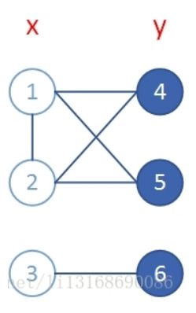

# 二分图

## 二分图的定义

二分图是什么？

假设有两个集合，每个集合有若干个顶点，同一个集合中的任意两个点之间没有边，不同集合中的两个点之间可能有边，这样的图就称作二分图。如下图（x,y分别为两个集合）：


这就引出了一个题型，如何判定一个图是不是二分图。

## 判定图是否是二分图

这里有一个定理，如果一个图是二分图，那它至少有2个顶点，而且所有**回路**的**长度（边数）均为偶数**，无回路的图必定是二分图。

如下图：


很明显，这个图是二分图，且只存在1-4-2-5-1，长度为4的回路。

如果给1和2之间加一条边，如下图：




这个图明显不是二分图，且存在1-2-4-1，长度为3的回路。

要证明也很简单：

因为上面已经定义了二分图中同一个集合中的任意两个顶点之间不可能存在边，所以我们假设二分图中存在回路，该回路从x中的顶点x0出发， 那下一步只能到y中的顶点去，然后又回到x，又回到y，又回到x……最后只能从y回到起点x0，所以此回路的长度必定是2n（n为正整数）。

### 代码实现

这里可以直接对图dfs，用两个颜色，对所有顶点逐个染色，且相邻顶点染不同颜色，如果相邻顶点颜色相同，那此图就不是二分图，当所有顶点染完色后，没有发现同色的相邻顶点，就可以判断此图是二分图了。

``` c++
const int N = 505;
int n,m;// n为顶点数，m为边数
int color[N]; // 顶点对应的颜色
vector<int> node[N]; // 邻接表
bool dfs(int now,int c)
{
    color[now] = c; // 当前顶点染色
    for(int i = 0;i < node[now].size();i++)
    {
        int tmp = node[now][i]; // 以now为起点的边对应的终点
        if(color[tmp] == c) // 相邻顶点颜色相同，返回false
        {
            return false;
        }
        if(color[tmp] == 0 && !dfs(tmp,-c)) // 还没染色，就染上相反颜色-c并继续dfs
        {
            return false;
        }
    }
    return true; // 涂色完毕，不存在同色的相邻顶点
}
int main()
{
    scanf("%d%d",&n,&m);
    memset(color,0,sizeof(color));
    for(int i = 0;i < m;i++)
    {
        int u,v;
        scanf("%d%d",&u,&v);
        node[u].push_back(v); 
        node[v].push_back(u); 
    }
    int flag = 1;
    for(int i = 0;i < n;i++) // 从0开始染色
    {
        if(color[i] == 0)
        {
            if(!dfs(i,1))
            {
                flag = 0;
            }
        }
    }
    printf("%s\n",flag ? "Yes" : "No");
    return 0;
}
```

## 二分图匹配

- 匹配：在二分图中，选取一个边集M，并且保证M中每个顶点只出现一次，即M中任意两条边，不可能有相同的顶点。

  如下图红线部分：


- 最大匹配：在二分图中，找一个边数最多的匹配（上图红线部分是最大匹配）。

- 完美匹配：在二分图中，找一个所有的顶点都是匹配点的匹配（上图红线部分是完美匹配）。
- 最大（最小）权匹配：在二分图中，给每条边赋一个权值，找一个权值和最大（最小）的匹配。

二分图最典型的题型就是求二分图最大匹配和二分图最大（最小）权匹配。

### 求最大匹配（匈牙利算法）

给个例子：

> 假设你是媒人，现在有4个男嘉宾和4个女嘉宾在相亲，男嘉宾和女嘉宾之间可能存在好感（如下图红线部分），你也只能给两个互相有好感的人说媒。你的上司说了，每凑成一对，你就会有一笔**固定的**奖金，所以你的任务就是凑成尽可能多对的情侣，问你最多能凑成几对（图片是下面那篇博客的，直接用了）


解决这个问题，我们需要**匈牙利算法**(这里的讲解思路参考了[一篇能快速看懂匈牙利算法的优秀博客](https://blog.csdn.net/sunny_hun/article/details/80627351))：

第一步：我们按顺序先帮1号男嘉宾说媒，发现第一个跟他相连的1号女嘉宾还单身，我们先凑成他们，连上蓝线


第二步：给2号男嘉宾说媒，发现第一个跟他相连的2号女嘉宾还单身，我们也凑成他们，连上蓝线


第三步：给3号男嘉宾说媒，发现第一个跟他相连的1号女嘉宾已经跟1号男嘉宾在一起了，没关系，我们先把他们暂时拆掉，画上黄线，给1号男嘉宾寻找新的女嘉宾：


但是与1号男嘉宾相连的下一个女嘉宾2号也已经跟2号男嘉宾在一起了，没关系，我们再把他们暂时拆掉，同样画上黄线，给2号男嘉宾寻找新的女嘉宾：


此时发现3号女嘉宾还单身，所以我们果断撮合2号男嘉宾和3号女嘉宾，然后再回去撮合1号男嘉宾和2号女嘉宾，再然后3号男嘉宾就可以和1号女嘉宾在一起了。很明显，这是一个递归的过程，得到下面的结果：


第四步：给4号男嘉宾说媒，发现跟他唯一相连3号女嘉宾已经有另一半了，我们依旧按照第三步的方法，但是很遗憾，没办法给4号男嘉宾**腾**出来一个女嘉宾了，所以最多就只能撮合3对情侣。

这个就是匈牙利算法的流程，本质上就是一个递归的过程。

#### 代码实现

```c++
const int N = 505;
int nb,ng,m;// nb为男生数，ng为女生数，m为边数
int match[N]; // match[i]表示与第i位女嘉宾暂时配对的男嘉宾的编号，没有则为0
int vis[N]; // vis[i]表示第i位女嘉宾在当前男嘉宾的这一轮dfs过程中是否已经访问过
vector<int>g[N]; // g[i][j]表示i与j之前存在好感
bool dfs(int u)
{
    for(int i = 0;i < (int)g[u].size();i++)
    {
        int v = g[u][i];
        if(vis[v] == 0) // 如果女嘉宾与当前男嘉宾有好感，而且还没访问过
        {
            vis[v] = 1; // 表示这一轮dfs已访问过
            if(match[v] == 0 || dfs(match[v])) // 如果该女嘉宾还没有另一半，或者该女嘉宾的另一半可以另外分配一个女嘉宾
            {
                match[v] = u; // 则该女嘉宾与当前男嘉宾配对成功
                return true;
            }
        }
    }
    return false;
}
int main()
{
    scanf("%d%d%d",&nb,&ng,&m);
    memset(match,0,sizeof(match));
    for(int i = 0;i < m;i++)
    {
        int u,v;
        scanf("%d%d",&u,&v);
        g[u].push_back(v); // 虽然是无向边，但是我们只需要知道男嘉宾对哪些女嘉宾有好感即可
    }
    int ans = 0; // 最大匹配数
    for(int i = 1;i <= nb;i++)
    {
        memset(vis,0,sizeof(vis)); // 每一步都需要初始化
        if(dfs(i))
        {
            ans++; // 匹配数+1
        }
    }
    printf("%d\n",ans);
    return 0;
}
```

#### 算法复杂度

每次dfs，vis[]组保证每个点每条边都只被访问一次，所以算法复杂度上限为O(nm)(n为男生数，m为边的总数)

### 求最大权匹配（KM算法）

给个例子：

> 假设你还是媒人，现在剩3个男嘉宾和3个女嘉宾在相亲，男人和女人之间还是可能存在好感（如下图红线部分），你也还是只能给两个互相有好感的人说媒。但是，你的上司这次说了，每撮合一对，奖金的多少由这对情侣给你包的红包决定，红包里面的钱是这对情侣商量之后的结果（边权），一个男嘉宾和**不同**女嘉宾商量后包的红包**大小不同**（如下图）。问你最多能拿到多少钱。


解决这个问题，我们需要**KM算法**，而KM算法的实质，就是求二分图权值和最大的**完美匹配**。

那么可能有人要问了，如果二分图不存在完美匹配，不就不能用KM算法了吗？

其实解决的方法也很简单，如果两个集合中的点数不同，我们就给点数少的集合补点，使得点数相同，再把不存在的边连上一条边权为0的边即可，这样即使选取了这条边，权值和加上0大小也不变。

这里给一个新的概念：**顶标l**（可以理解为顶点的值）。只有满足**l [x] + l [y] == w [x] [y]** （即左顶点值与右顶点值的和等于它们之间相连边的权值），这条边才能作为匹配边。

简单来说，KM算法就是先限定好了**最终的权值和**，然后寻找能不能在这个条件下找到完美匹配。这也是为什么初始的顶标值，左边的每个顶点是与它有关的边的最大权值，右边的默认为0。

先简化一下上面那张图，顺便加上顶标（别问为什么简化，问就是画图太难了，网上有现成的图为什么不直接用）


KM算法具体流程：

- 第一轮匹配：

  B1：选择G3，匹配成功，该轮匹配结束。


- 第二轮匹配：

  B2：选择G3，但G3与B1已匹配，B2没有其他选择，B1也不能与其他女嘉宾匹配，匹配失败。

***

这一轮参与的有B1，B2，G3，既然失败了，我们就得另辟蹊径：

很容易想到，我们只要这两个男嘉宾的顶标值降低一些，就可以选择其他女嘉宾了，那要降低多少呢？

这个也很容易想到，只要判断一下两个男嘉宾在没参与这一轮匹配的女嘉宾中，顶标值降低最少多少，才可以与这些女嘉宾进行匹配，这个值就是要降低的值。比如B1选择G1，则顶标值降低1；B2选择G1，顶标值降低1；B2选择G2，顶标值降低2。于是，顶标值至少得降低1，B2就可以选择其他女生了。

在降低的同时，为了保证B1到G3，B2到G3的边依旧可行，我们需要给G3的顶标值增加1，同时B1的顶标值也得降低1，如下图（既然B2可以选择其他女嘉宾了，B1和G3则保持匹配）：


---

​		继续这轮匹配：

​		B2：选择G1，匹配成功，该轮匹配结束。


- 第三轮匹配：

  B3：没有可以匹配的边，匹配失败。

---

此时很容易发现，B3只要顶标值降低1，就可以与G3进行匹配，所以B3顶标值降低1。


***

​		继续匹配：

​		B3：选择G3，但是此时G3已经与B1匹配，没关系，B1可以选择G1，但是此时又发现G1与B2已经匹配，而B2没有其他选择了，匹配又失败了。

***

这时也很容易发现，B2的顶标值只要降低1，就可以与没参与这轮匹配的G2匹配。

这一轮的参与的有B3，G3，B1，G1，B2，我们重复上一轮匹配的做法：

B2顶标值降低1，相应的G1增加1，B1降低1，G3增加1，B3减少1，如下图：


***

​		继续匹配：

​		B3：选择G3，G3与B1已经匹配，没关系，B1：选择G1，G1与B2已经匹配，没关系，B2：选择G2，匹配成功，该轮匹配结束。


得到完美匹配后，所求的最大权值和等于所有顶标值的和，即2+1+1+0+3+2=9。

以上就是KM算法的整个流程，求完美匹配的话，很明显，需要匈牙利算法的参与，所以KM算法的代码也有匈牙利算法的部分。

#### 代码实现（dfs）

代码有点长，我们分开看。

首先是初始化的部分：

```c++
const int INF = 0x3f3f3f3f;
const int N = 505;
int nx,ny,m,n; // 依次为男嘉宾数，女嘉宾数，边数
int w[N][N]; // 边权
int slack[N]; // slack[i]表示每次匹配失败，参与该轮匹配的男嘉宾需要降低多少顶标值才可以与没参与该轮匹配的第i个女嘉宾匹配
int match[N]; // match[i]表示与第i位女嘉宾暂时配对的男嘉宾的编号，没有则为0
int visx[N],visy[N]; // visx[x],visy[y]表示第x位男嘉宾和第y位女嘉宾在当前男嘉宾的这一轮dfs过程中是否已经访问过
int lx[N],ly[N]; // 顶标值
void setvalue()
{
    scanf("%d%d%d",&nx,&ny,&m);
    n = max(nx,ny); // 补点后两边的点数为原来两边点数最大的一个
    memset(w,0,sizeof(w));// 不存在的边默认权值为0
    memset(lx,0,sizeof(lx));
    memset(ly,0,sizeof(ly));
    memset(match,0,sizeof(match));
    for(int i = 0,u,v,c;i < m;i++)
    {
        scanf("%d%d%d",&u,&v,&c);
        w[u][v] = c; // 单向边
        if(w[u][v] > lx[u])
        {
            lx[u] = w[u][v];// 左边各点顶标值为与各顶点相连的边权最大值
        }
    }
}
```

接下来，是KM算法的主体部分：

```c++
void KM()
{
    for(int i = 1;i <= n;i++)
    {
        for(int j = 1;j <= n;j++)
        {
            slack[j] = INF; // 求的最小值，所以初始化为正无穷，不懂的可以看上面slack[i]的定义
        }
        while(true) // 每轮匹配都是保证第i位男嘉宾有女嘉宾可选了才结束
        {
            memset(visx,0,sizeof(visx));
            memset(visy,0,sizeof(visy));
            if(dfs(i))
            {
                break;
            }
            else
            {
                int delta = INF; // 需要降低的最小顶点值
                for(int j = 1;j <= n;j++)
                {
                    if(!visy[j] && delta > slack[j])
                    {
                        delta = slack[j];
                    }
                }
                for(int j = 1;j <= n;j++)
                {
                    if(visx[j])
                    {
                        lx[j] -= delta; // 左边降低
                    }
                    if(visy[j])
                    {
                        ly[j] += delta; // 右边增加
                    }
                    else
                    {
                        slack[j] -= delta;
                    }
                }
            }
        }
    }
}
```

然后，是KM函数里面，dfs的部分（这里跟匈牙利算法的代码其实差不多）

```c++
bool dfs(int x)
{
    int tmpdelta;
    visx[x] = 1;
    for(int y = 1;y <= n;y++)
    {
        if(visy[y])
        {
            continue;
        }
        tmpdelta = lx[x] + ly[y] - w[x][y];
        if(tmpdelta == 0) // x到y这条边可选
        {
            visy[y] = 1;
            if(match[y] == 0 || dfs(match[y])) // 如果该女嘉宾还没有另一半，或者该女嘉宾的另一半可以另外分配一个女嘉宾
            {
                match[y] = x;
                return true;
            }
        }
        else if(slack[y] > tmpdelta)
        {
            slack[y] = tmpdelta;
        }
    }
    return false;
}
```

最后，就是根据顶标值求出最大权值和了：

```c++
int getans()
{
    int ans = 0;// 得到的最大权值和为各顶标值之和
    for(int i = 1;i <= n;i++)
    {
        ans += lx[i];
        ans += ly[i];
    }
    printf("%d\n",ans);
}
```

完整代码：

```c++
const int INF = 0x3f3f3f3f;
const int N = 505;
int nx,ny,m,n; // 依次为男嘉宾数，女嘉宾数，边数
int w[N][N]; // 边权
int slack[N]; // slack[i]表示每次匹配失败，参与该轮匹配的男嘉宾需要降低多少顶标值才可以与没参与该轮匹配的第i个女嘉宾匹配
int match[N]; // match[i]表示与第i位女嘉宾暂时配对的男嘉宾的编号，没有则为0
int visx[N],visy[N]; // visx[x],visy[y]表示第x位男嘉宾和第y位女嘉宾在当前男嘉宾的这一轮dfs过程中是否已经访问过
int lx[N],ly[N]; // 顶标值
bool dfs(int x)
{
    int tmpdelta;
    visx[x] = 1;
    for(int y = 1;y <= n;y++)
    {
        if(visy[y])
        {
            continue;
        }
        tmpdelta = lx[x] + ly[y] - w[x][y];
        if(tmpdelta == 0) // x到y这条边可选
        {
            visy[y] = 1;
            if(match[y] == 0 || dfs(match[y])) // 如果该女嘉宾还没有另一半，或者该女嘉宾的另一半可以另外分配一个女嘉宾
            {
                match[y] = x;
                return true;
            }
        }
        else if(slack[y] > tmpdelta)
        {
            slack[y] = tmpdelta;
        }
    }
    return false;
}
int main()
{
    scanf("%d%d%d",&nx,&ny,&m);
    n = max(nx,ny); // 补点后两边的点数为原来两边点数最大的一个
    memset(w,0,sizeof(w));// 不存在的边默认权值为0
    memset(lx,0,sizeof(lx));
    memset(ly,0,sizeof(ly));
    memset(match,0,sizeof(match));
    for(int i = 0,u,v,c;i < m;i++)
    {
        scanf("%d%d%d",&u,&v,&c);
        w[u][v] = c; // 单向边
        if(w[u][v] > lx[u])
        {
            lx[u] = w[u][v];// 左边各点顶标值为与各顶点相连的边权最大值
        }
    }
    for(int i = 1;i <= n;i++)
    {
        for(int j = 1;j <= n;j++)
        {
            slack[j] = INF; // 求的最小值，所以初始化为正无穷，不懂的可以看上面slack[i]的定义
        }
        while(true) // 每轮匹配都是保证第i位男嘉宾有女嘉宾可选了才结束
        {
            memset(visx,0,sizeof(visx));
            memset(visy,0,sizeof(visy));
            if(dfs(i))
            {
                break;
            }
            else
            {
                int delta = INF; // 需要降低的最小顶点值
                for(int j = 1;j <= n;j++)
                {
                    if(!visy[j] && delta > slack[j])
                    {
                        delta = slack[j];
                    }
                }
                for(int j = 1;j <= n;j++)
                {
                    if(visx[j])
                    {
                        lx[j] -= delta; // 左边降低
                    }
                    if(visy[j])
                    {
                        ly[j] += delta; // 右边增加
                    }
                    else
                    {
                        slack[j] -= delta;
                    }
                }
            }
        }
    }
    int ans = 0;// 得到的最大权值和为各顶标值之和
    for(int i = 1;i <= n;i++)
    {
        ans += lx[i];
        ans += ly[i];
    }
    printf("%d\n",ans);
    return 0;
}
```

#### 代码实现（bfs）

有些题目会卡dfs，巨恶心，这里多给一个bfs的模板。

```c++
#include<cstdio>
#include<cstring>
#include<algorithm>
#include<queue>
using namespace std;
const int N = 505;
const int INF = 0x3f3f3f3f;
int nx,ny,n,m;
int lx[N],ly[N];
int visx[N],visy[N];
int w[N][N];
int slack[N];
int matchx[N],matchy[N]; // matchx[i]表示与第i位男嘉宾暂时配对的女嘉宾的编号，matchy[i]同理，没有则为0
int pre[N]; // 连接右集合的左边的点
queue<int>q;
bool check(int v)
{
    visy[v] = true;
    if(matchy[v] != 0) // 如果v已经与matchy[v]匹配，则将matchy[v]加入队列
    {
        q.push(matchy[v]);
        visx[matchy[v]] = 1;
        return false;
    }
    while(v != 0) // 找到新的未匹配点，更新匹配点pre数组记录着"非匹配边"上与之相连的点
    {
        matchy[v] = pre[v];
        swap(v,matchx[pre[v]]);
    }
    return true;
}
void bfs(int x)
{
    while(!q.empty())
    {
        q.pop(); // 清空队列
    }
    q.push(x);
    visx[x] = 1;
    while(true)
    {
        while(!q.empty())
        {
            int u = q.front();
            q.pop();
            for(int v = 1;v <= n;v++)
            {
                if(!visy[v]) // v号女嘉宾在该轮bfs中还未访问过
                {
                    int tmpdelta = lx[u] + ly[v] - w[u][v];
                    if(slack[v] >= tmpdelta)
                    {
                        pre[v] = u;
                        if(tmpdelta)
                        {
                            slack[v] = tmpdelta;
                        }
                        else if(check(v)) // 说明u到v的边可以作为匹配边
                        {
                            return;
                        }
                    }
                }
            }
        }
        // 无法找到一条新的可匹配边，修改顶标值，
        int delta = INF;
        for(int j = 1;j <= n;j++)
        {
            if(!visy[j])
            {
                delta = min(delta,slack[j]);
            }
        }
        for(int j = 1;j <= n;j++)
        {
            if(visx[j])
            {
                lx[j] -= delta;
            }
            if(visy[j])
            {
                ly[j] += delta;
            }
            else
            {
                slack[j] -= delta;
            }
        }
        for(int j = 1;j <= n;j++)
        {
            // 修改顶标值后，如果有一条可选择的未匹配边，则加入匹配并结束此轮bfs
            if(!visy[j] && slack[j] == 0 && check(j)) 
            {
                return;
            }
        }
    }
}
int main()
{
    scanf("%d%d%d",&nx,&ny,&m);
    n = max(nx,ny);
    for(int i = 0,u,v,c;i < m;i++)
    {
        scanf("%d%d%d",&u,&v,&c);
        w[u][v] = c;
        if(c > lx[u])
        {
            lx[u] = c;
        }
    }
    memset(matchx,0,sizeof(matchx));
    memset(matchy,0,sizeof(matchy));
    for(int i = 1;i <= n;i++)
    {
        memset(visx,0,sizeof(visx));
        memset(visy,0,sizeof(visy));
        for(int j = 1;j <= n;j++)
        {
            slack[j] = INF;
        }
        bfs(i);
    }
    int ans = 0;
    for(int i = 1;i <= n;i++)
    {
        ans += lx[i];
        ans += ly[i];
    }
    printf("%d\n",ans);
    return 0;
}
```

#### 算法复杂度

KM算法需要枚举nx个点，最差情况下每轮匹配要dfs全部的nx个点，每次dfs还需要对ny个点进行判断，又因为是求完美匹配，所以nx = ny = n（两者中最大的一个），所以算法复杂度为O（n³）。

### 求最小权匹配

求最小权匹配其实还是用KM算法，只要把边的权值取相反数，然后不存在的边的边权默认为负无穷，再对图求最大权匹配，得到的最大权值和再取相反数就是要求的最小权值和了。

## 补充

### 网络流和费用流 

二分图最大匹配可以转换成网络流模型，用**Dinic算法**求该网络的最大流，可在O()求出。

二分图最大权匹配也可以转换成费用流模型。

限于篇幅，这些不做展开。

### 二分图最大独立集

选最多的点，满足两两之间没有边相连。

二分图中，最大独立集 = n - 最大匹配（n为图的顶点数），即除了最大匹配集合里的点，剩余的点都属于最大独立集。

### 二分图最小点覆盖

选最少的点，满足图中每条边至少有一个端点被选，不难发现补集是独立集。

二分图中，最小点覆盖 = n - 最大独立集（n为图的顶点数）。


# 2-SAT问题

## 2-SAT的定义

**SAT（Satisfiability）**问题，就是适定性问题，一般表述如下：有很多个集合 ，每个集合里面有若干元素，现给出一些**取元素的规则**，要你判断是否可行，可行的话**有时候**会让你给出一个可行方案。如果所有集合中，元素个数最多的集合有k个，那么我们就说这是一个k-SAT问题，同理，2-SAT问题就是k = 2时的情况。

举个例子：

> 现在一对新人结婚，邀请一些情侣来参加婚礼，但空间有限，每对情侣两人中只能邀请一个，而且这对新人在当地很有名望，如果情侣二人要是不给面子都不去的话，他们会有麻烦，即情侣二人必须也只能去一个。然而有些人之间还可能存在矛盾（情侣之间保证不会有矛盾），如果同时出现在婚礼上，两个人可能会闹事从而影响婚礼的进行。现在告诉你有多少对情侣受邀请，而且告诉你存在的矛盾关系，问你是否存在一个邀请的方案，能避免来的人之间存在矛盾关系。

## 如何解决这个问题

首先，建图：

假设有a1,a2和b1,b2两对情侣，已知a1和b2间有矛盾，于是为了满足题意，我们拉两条有向边a1 -> b1，b2 -> a2，即选择了a1就必须选b1，选择了b2就必须选a2：


建完图后，有两种方法可以解决这个问题。

### 方法一：暴搜

沿着图上一条路径，如果一个点被选择了，那么这条路径以后的点都将被选择，那么，出现不可行的情况就是，存在一个集合中两者都被选择了。我们只要枚举一下，答案就出来了。

**特别的，如果存在邀请方案的时候题目要求输出最小字典序，那么只能用暴搜解决。**

#### 代码实现

```c++
const int maxn = 16010,maxm = 40010;
vector<int>g[maxn];// 邻接表
int stk[maxn],top; // 模拟栈
int n,m;           // n为情侣数，m为矛盾关系
bool vis[maxn];    // vis[i]表示点i是否被邀请
bool dfs(int x)
{
    if(vis[x]) return true; // 如果回到x，说明该路径可行
    if(vis[x ^ 1]) return false; // 如果x的伴侣也被邀请，说明该路径不可行
    vis[x] = true; // x被邀请
    stk[++top] = x; // 将x放入栈中
    for(int i = 0;i < (int)g[x].size();i++)
    {
        if(!dfs(g[x][i])) // 对x指向的点继续遍历
        {
            return false;
        }
    }
    return true;
}
bool solve()
{
    memset(vis,0,sizeof(vis));
    for(int i = 0;i < 2 * n;i += 2)
    {
        if(!vis[i] && !vis[i ^ 1]) // 情侣两人都没还没被邀请
        {
            top = 0; // 清空栈
            if(dfs(i)) // 先判断情侣中字典序小的能否被邀请
            {
                continue;
            }
            while(top) // 如果不行，将栈清空，并把栈里元素的vis[]变成false
            {
                vis[stk[top--]] = false;
            }
            if(!dfs(i ^ 1)) // 判断情侣中字典序大的能否被邀请
            {
                return false; // 两人都不能被邀请，则没有方案可行
            }
        }
    }
    return true;
}
void init() // 初始化
{
    scanf("%d%d",&n,&m);
    for(int i = 0;i < maxn;i++)
    {
        g[i].clear();
    }
    while(m--)
    {
        // 对于情侣i，我们假设一个为2*i-1，一个为2*i-2，这样做之后，对任意一个人x来说，x^1就是他/她的伴侣
        int x,y;
        scanf("%d%d",&x,&y);
        x--;y--;
        g[x].push_back(y ^ 1); // 选择x就得选择y的伴侣
        g[y].push_back(x ^ 1); // 选择y就得选择x的伴侣
    }
}
int main()
{
    init();
    if(!solve())
    {
        printf("Impossible\n");
    }
    else 
    {
        printf("Possible\n");
        /* 如果题目要求输入字典序小的方案，则写下面代码就可以输出
        for(int i = 0;i < 2 * n;i++)
        {
            if(vis[i])
            {
                printf("%d\n",i + 1);
            }
        }  
        */
    }
    return 0;
}
```

#### 算法复杂度

每次贪心的选择一个，然后dfs删除影响 ，所以时间复杂度是O(nm)的（n为情侣数，m为边数）

### 方法二：Tarjan SCC 缩点法

**建完图后，我们跑一遍Tarjan 缩点判断是否有一个集合中的两个元素在同一个SCC中，若有则输出不可能，没有则根据需求输出方案。**

- 强连通分量（SCC） ：即在有向图中，找一个最大的子图，使得该子图所有的点可以互相到达，这个子图就叫强连通分量，并且一个点也算一个强连通分量，如下图，有三个强连通分量（圆圈部分），分别为1 - 2 - 3 和 4 还有 5：


#### 如何找强连通分量（Tarjan SCC缩点）

我们根据上面那幅图，从点1开始dfs，可以发现下图红色的边很奇特：


按照遍历时间来分类的话，其他边都指向在自己之后被遍历到的点，而红边指向的则是比自己先被遍历到的点。

我们可以想一下，从一个点u出发，向下遍历，如果能找到另一个点v，并且点v存在一条指向点u的边，那么是不是可以说明点u和点v包括u到v之间的点存在一个回路？而且可以说明这个回路上的点都是强连通的？

当然，这里只是能得到该回路是强连通的，并不能说明该回路是强连通分量，因为我们不能保证它是最大的，如图：


蓝色部分我们可以判断出是强连通的，但是整个红色的部分才是一个强连通分量。

**那要怎么解决呢？怎么在退回到点u的时候，知道所有和点u构成强连通分量的点呢？**

往下看。

#### 如何实现

我们需要一些辅助数组

- **dfn[ i ]**，表示点 i 在dfs时是第几个被搜到的。
- **low[ i ]**，表示点 i 以及其子孙节点连的所有点中dfn最小的值（即最早被找到的）。
- **stack[ ]**，表示当前所有可能能构成是强连通分量的点（栈）。
- **vis[ i ]**，表示点 i 是否在stack[ ]（栈）中。
- **scc[ i ]**，表示点 i 所属的强连通分量编号。

假设我们现在遍历点u：

1. 首先初始化dfn[ u ] = low[ u ] = 深度（第几个被dfs到的）;

2. 将u放入栈中，并且vis[ u ] = 1；

如果u在栈中，在u被回溯到时，u和栈中所有在它之后的点都构成强连通分量，这里后面解释。

3. 遍历u的每一个能到的点，如果这个点 v 的dfn[ v ]为0，即仍未访问过，那么就对点v进行dfs，然后取low[u] = min{low[u],low[v]}

如果已经被访问过但不在栈里，那么无论如何这个点也不能与u构成强连通分量。如果还在栈里，说明这个点肯定能到达u，同样u能到达他，他俩**强联通**。

4. 遍历完 u 的所有的子节点之后,无论我们再怎么dfs，u 点的low值已经不会再变了。

如果dfn[ u ] = low[ u ]，说明 u 点及 u 点的所有子节点没有边是指向它们的祖先了，即我们之前说的 u 点与它的子孙节点构成了一个最大的强连通图即**强连通分量**。

5. 把 u 点以及 u 点以后压入栈中的所有点弹出，将它们的vis[ ]置为false，并对它们的scc [ ]染色（表示它们属于同一个强连通分量）。

我们看下图：


我们从1开始，假设每次遍历到一个点，以他为起点的第一条边都是向右的（这样好懂一点），那么就会一直向下遍历，直到终点9，此时所有点的dfn和low就是相同的，而且所有的点都在栈中。但是到了9之后发现没有其他边可以走了，此时low[9] = dfn [9]，说明它只能自己算一个强连通分量，把9出栈，scc[9] = 1。


接下来回溯到8，发现8有一条回到6的边，所以low[8] = 6。

继续回溯到7，因为low[8]变成了6，而且每次回溯我们都会让回溯点u的 low[u] = min{low[u],low[v]}，所以相应的low[7] = low[8] =  6。

继续回溯到6时，6没有边可以回到前面的点了，而且dfn[6] = low[6]，所以将8、7、6依次出栈，并且scc[ 6、7、8 ] = 2。


继续回溯到5，发现5有一条边回到3，所以low[5] = 3。

继续回溯到4，low[4] = low[5] = 3。

继续回溯到3，发现3有一条边回到1，所以low[3] = 1。


继续回溯到2，low[2] = low[3] = 1。  

最后回溯到1，dfn[1] = low[1]，将栈中的5、4、3、2、1出栈，scc[1、2、3、4、5] = 3。

这个就是Tarjan 缩点的整个流程。

#### 代码实现

```c++
#include<bits/stdc++.h>
using namespace std;
const int N = 1e4 + 10;
int dfn[N],low[N],vis[N],scc[N];//看定义
stack<int>s;
int deep; // 当前dfs深度
int tot; // 当前强连通图编号
int n,m;
vector<int>g[N]; // 邻接表
void tarjan(int u)
{
    dfn[u] = low[u] = ++deep;
    vis[u] = 1;
    s.push(u);
    int len = g[u].size();
    for(int i = 0;i < len;i++)
    {
        int v = g[u][i];
        if(!dfn[v])
        {
            tarjan(v);
            low[u] = min(low[u],low[v]);
        }
        else
        {
            if(vis[v])
            {
                low[u] = min(low[u],low[v]);
            }
        }
    }
    if(dfn[u] == low[u])
    {
        scc[u] = ++tot;
        vis[u] = 0;
        while(s.top() != u)
        {
            scc[s.top()] = tot;
            vis[s.top()] = 0;
            s.pop();
        }
        s.pop();
    }
}
void add_edge(int u,int v) // 每道题的建图方式不同，之后会说，根据题目情况建图。
{
    g[u].push_back(v);
}
int main()
{
    scanf("%d%d",&n,&m);
    for(int i = 0;i < m;i++)
    {
        int from,to;
        scanf("%d%d",&from,&to); // 这里是对任意图求连通分量，所以from和to表示的只是有向边
        add_edge(from,to);     
    }
    memset(dfn,0,sizeof(dfn));
    memset(scc,0,sizeof(color));
    deep = 0;
    tot = 0;
    for(int i = 1;i <= n;i++)
    {
        if(!dfn[i]) // 可能存在多个独立子图
        {
            tarjan(i);
        }
    }
    /*
    for(int i =1;i <= n;i++)
    {
        if(scc[i] == scc[i ^ 1])
        {
             printf("Impossible");
        }
    }
    */
    return 0;
}
```

#### 算法复杂度

看代码很容易看出来，只要遍历n个点，m条边，就可以实现整个流程，所以Tarjan算法复杂度为O（n+m）。

#### 几个问题

- **为什么有一个集合中的两个元素在同一个SCC中，就不可能有解决方法呢？看下图（同一个字母的是一对情侣）：**


这个图明显可以看出不存在强连通分量，而且也能看出一种方案就是邀请a2、b2、c2，我们加一条边：


很明显，这个图a1 - b2 - c1 - b2就是一个强连通分量了，而且怎么选都不可能选出一个方案（只要选择了b1/b2就必须选b2/b1）。

- **有方案时如何输出方案？**

这里涉及到反拓扑序的问题，讲起来会很复杂，不过实现起来就很简单了：

我们只要对每一对情侣，判断他们两的强连通分量编号谁小，谁小就选谁就可以了。

```c++
void printf()
{
    for(int i = 0;i < 2 * n;i += 2)
    {
        if(scc[i] < scc[i ^ 1]) // i的编号小，选i
        {
            printf("%d\n",i + 1);
        }
        else 
        {
            printf("%d\n",i ^ 1 + 1);
        }
    }
}
```

- **2-SAT问题其他取元素规则的建图？**

上面我们假设了有a1,a2和b1,b2两对情侣，已知a1和b2间有矛盾，于是我们拉了两条有向边a1 -> b1，b2 -> a2，这里的矛盾关系是两者只能取其一。

但其实建图还可能遇到其他情况，比如：

1. a1和b1不能同时不取，即选择了a2就只能选择b1，选择了b2就只能选择a1。这里连边a2 -> b1，b2 -> a1 。

2. a1和b1要么都取，要么都不取，即选择了a1就只能选择b1，反过来也一样；选择a2就必须选择b2，反过来也一样。

这里连边 a1 -> b1，b1 -> a1，a2 -> b2，b2 -> a2。

3. 情侣两人a1和a2必须选a2，这里连边a1 -> a2，至于为什么，如果我说是因为选择了a1就必须选a2，然后和题目所说的同个集合两者

只能选其一相违背的话，是很片面的。因为我们上面的算法只是利用了Tarjan SCC缩点判断同个集合的俩个元素在不在一个强连通分量里

面，如果我们选择了a1，但是只有a1能到a2，a2不能到a1的话，它们是不可能在同一个强连通分量里的，此时根本判断不出来。这里正

确的解释其实还是和拓扑序有关，不过讲起来也麻烦，就不展开了。

# 题单

[题解仓库，不会的进去看看吧。](https://gitee.com/sztuowk/Bipartite-graph_2-SAT)

序号 | 题号 | 标题 | 题型 | 难度
-- | -- | -- | -- | --
1 | 洛谷 1330 | 封锁阳光大学 | 二分图的判定、染色 | ⭐⭐
2 | 洛谷 1525 | 关押罪犯 | 二分、二分图的判定 | ⭐⭐
3 | HDU 2063 | 过山车 | 二分图最大匹配（模板题） | ⭐
4 | HDU 1083 | Courses | 二分图最大匹配 | ⭐⭐
5 | HDU 2444 | The Accomodation of Students | 二分图的判定+最大匹配 | ⭐⭐⭐
6 | POJ 1325 | Machine Schedule | 二分图最小点覆盖数 | ⭐⭐
7 | POJ 1466 | Girls and Boys | 二分图最大独立点集 | ⭐⭐
8 | HDU 2255 | 奔小康赚大钱 | 二分图最大权匹配 | ⭐⭐
9 | UOJ 80 | 二分图最大权匹配 | 二分图最大权匹配（卡dfs) | ⭐⭐⭐
10 | HDU 1814 | Peaceful Commission | 2-SAT暴搜 | ⭐⭐⭐
11 | 洛谷 2863 | The Cow Prom S | Tarjan求强连通分量 | ⭐⭐
12 | HDU 3062 | Party | 2-SAT tarjan算法 | ⭐⭐
13 | POJ 3678 | Katu Puzzle | 2-SAT tarjan算法 | ⭐⭐⭐
14 | POJ 3207 | Ikki's Story IV - Panda's Trick | 2-SAT tarjan算法 | ⭐⭐⭐⭐
15 | POJ 3683 | Priest John's Busiest Day | 2-SAT tarjan算法（输出方案）| ⭐⭐⭐⭐


# 参考资料

[二分图的定义和判定 CSDN](https://blog.csdn.net/li13168690086/article/details/81506044?ops_request_misc=%257B%2522request%255Fid%2522%253A%2522162722007216780366568206%2522%252C%2522scm%2522%253A%252220140713.130102334..%2522%257D&request_id=162722007216780366568206&biz_id=0&utm_medium=distribute.pc_search_result.none-task-blog-2~all~sobaiduend~default-1-81506044.first_rank_v2_pc_rank_v29&utm_term=%E4%BA%8C%E5%88%86%E5%9B%BE%E5%88%A4%E5%AE%9A&spm=1018.2226.3001.4187)

[趣写算法系列之--匈牙利算法 CSDN](https://blog.csdn.net/sunny_hun/article/details/80627351)

[tarjan求强连通分量+缩点+割点/割桥（点双/边双）以及一些证明 CSDN](https://blog.csdn.net/weixin_30273931/article/details/99029674?ops_request_misc=%257B%2522request%255Fid%2522%253A%2522162799769516780262557856%2522%252C%2522scm%2522%253A%252220140713.130102334..%2522%257D&request_id=162799769516780262557856&biz_id=0&utm_medium=distribute.pc_search_result.none-task-blog-2~all~sobaiduend~default-1-99029674.first_rank_v2_pc_rank_v29&utm_term=tarjan%E6%B1%82%E5%BC%BA%E8%BF%9E%E9%80%9A%E5%88%86%E9%87%8F&spm=1018.2226.3001.4187)

[0403省选课【2-SAT】B站 ](https://www.bilibili.com/video/BV14K4y1C7Cx?from=search&seid=1555829711153297431)2-SAT教学视频，如果实在看不懂，可以看看视频，挺详细的
