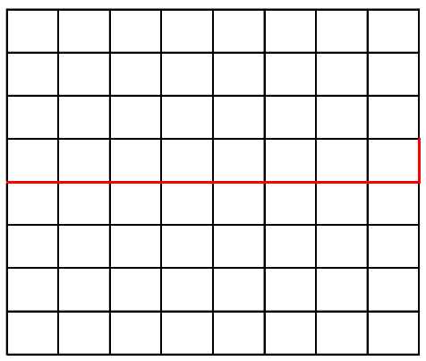
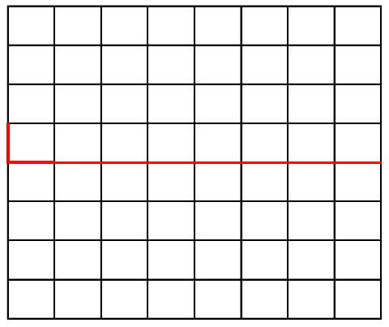

轮廓线动态规划 是 状态压缩动态规划 的一种，大多为规模较小的棋盘网格（长宽20以内）上的计数问题。

## 网格


棋盘状的格子图。

我们从最简单的例子开始理解：一个 `8 * 8` 的 网格图中，每个格子填一个数字，该数字为它上面和左面相邻格子数字之和。最左上格子填 1，最右下格子填多少？

**首先：** ：我们直接在一个 `8*8` 的数组上进行，从左上的格子一行一行地从上到下递推。确定每个格子的数字，只需要它左边和它上边的信息。 **空间 `8 * 8` **， 

```cpp
int dp[8][8];
//. ..
dp[i][j] = dp[i - 1][j] + dp[j][i - 1];
```

**进一步考虑** ：我们要确定一行的数字时，它前一行之前的信息其实已经不需要了，用滚动数组。 


```cpp
int dp[2][8];
//. ..
dp[i & 1][j] = dp[~i & 1][j] + dp[i & 1][j - 1];
```

我们在确定每个格子的数值时（如下图蓝色），其实在维护一个轮廓的信息（如下图红色），


这就是轮廓概念的雏形了， **别急** ，这还不是轮廓线。

## 轮廓线与插头

看一个轮廓线DP的经典题：一个网格图上，部分格子标记为不能通过，在网格图上走一些回路保证每个可行格子经过且只经过一次，有多少种方案：


第一次看到这种题，恐怕一下就头皮发麻了，完全没有下手的地方。

我们这样考虑，如果有一个沿着网格的边从左到右的线，这个线与答案要求的回路有哪些关系和性质：


回路的路径会穿过这条线，如果给回路定义个顺时针方向，那么这条线就在某个位置被从下向上穿过，而另某个位置被从上向下穿过。

每个网格里的路径有哪些形状？

          


轮廓线 DP 的方法，就是从上到下，从左到右，对每个网格做决策，决策内容是这个网格应该是上面几种形状的哪一个，从而通过状态转移完成动态规划，在最右下角结束，统计出方案个数。

决策的依据是什么？ 是它上面的和左边的格子。

但这个问题比递推上下格子的和复杂多了，上边和左边的格子也会有很多可能性，动态规划当然是统计所有可能性的和。

**我们把这当作一个拼图游戏**，从上往下、从左往右地挨个放合理的拼图，假设已经处理到了一个具体的格子，它前面的行，以及它这一行左边的格子都已经放了某种拼图方案：


一个合理的回路，这个格子的左边与上边放的拼图无非有 4 种可能性：

1. 左边伸过来，上边没伸
2. 左边没伸，上边伸过来了
3. 左边伸过来，上边也伸过来
4. 左边和上边都没有

把这当作一个拼图游戏，我们需要往这个格子放一个合理的拼图块。对于前 3 种，没得选，左边来上边没来，那肯定这一格要继续往右边走。左边没有上边有，就往下走。左边上边都有，那一定得填一个拐角把它们接起来。

如果左边上边都没有，仿佛是有得选了。但考虑一下这道题的要求：“回路”，“所有格子经过且只经过一次“，如果这一格放了个横向或竖向的拼图，那么这个线的另一头就”悬空“了，因为我们是从上往下、从左往右地放，它左边和上边的格子是已经定的方案，不会再有格子接下这个接头，最后拼完拼图，那个悬空的头显然没有构成回路。同理，放朝上或朝左的拐角也不行。但放一个朝右朝下的拐角是可以的，因为它右边和下边的格子还没放拼图，总有机会把他们接起来。

好，现在我们来聊聊轮廓线与插头。

在考虑一个特定格子时，需要相邻的上边格子与左边格子的信息，而这不是那个递推问题，上边和左边都会有很多种可能性。动态规划我们很熟悉了，会有个状态空间，我们是从一个状态空间转移到下一个状态空间。如果用前文的滚动数组（`dp[2][8]`） ，存这个状态空间就会很棘手：

- 状态转移时，又要用上面格子，又要用左边格子，属于两行，如果用滚动数组，枚举状态空间很不方便
- 一行格子的很多种可能性，要开很多维的数组？显然这里我们用状态压缩

我们发现，决策一个格子填哪个拼图的关键，并不是上边和左边格子填的是哪个拼图这件事，而是上边和左边的拼图有没有伸过来的路径，或者说现在这个格子要不要对接一个伸过来的路径 —— 这像个插头啊。

所以我们不需要用滚动数组表达两行的内容，只需要记录一条轮廓线上是否有插头就好了：


对于状态压缩，我们也不需要考虑每个格子的拼图类型了（8种拼图需要 3 个二进制位，8个格子共需要 `3 * 8 = 28` 个二进制位）。如果我们只是压缩这个轮廓线呢？

数一数轮廓线记录了几个边界的插头：左边的格子下面的边、当前块与右边格子上面的边、左边挨着的格子的这个侧边，一共是 `8 + 1 = 0` 个边界插头记号，有与没有插头是两种情况，只需要一个二进制位，所以记录一个轮廓线需要 `9` 个二进制位，状态空间也相当明晰，`2^9 == 512`，很好枚举嘛。

**强迫症患者难以接受的不工整**，明明 8 个格子，整出长度是 9 的轮廓来，很难受啊。这是理解与接受轮廓线 DP 的关键点。

这长度为 9 的轮廓怎么使用：

- 从 `0` 开始编号，格子的编号是范围是 `[0, 7]`共8 个，轮廓的编号是 `[0, 8]` 共 9 个，第 `j` 个格子左侧的轮廓编号是 `j`，上方轮廓是 `j + 1`。 
- 轮廓虽然是一行的信息，但我们是一格一格DP的，即每右移一格到达第 `j` 个格子时，状态空间的所有轮廓，`0~j-1`编号表达的是左边 `j`个格子朝下是否有插头的轮廓，这些信息对这一行的格子更新已经用不到了，它们会在DP到下一行时被用到。即我们是带着整行的轮廓信息，但一格一格地去DP和更新轮廓状态空间。

对一个特定格子的状态转移用伪代码表示就是：

```cpp
// `j` is this block
for status in contour:
    nextstatus = status;
    if status(j) == 有插头:                        // 有左边过来的插头
        set nextstatus(j + 1) = 有插头             // 路径要往右边去，当处理 编号为`j+1`的格子时候，格子会查看编号为`j+1`轮廓状态是否有插头
        dp[now][nextstatus] += dp[nex][status];    // 传统 DP 的计数转移
        insert nextstatus into nexcontour;         // 记录新状态到状态空间，在处理下一个格子时就从转移的状态空间取状态
    if status(j+1) == 有插头:                      // 有上边过来的插头
        set nextstatus(j) = 有插头                 // 这个信息在处理下一行的格子才会用到
        dp[now][nextstatus] += dp[nex][status];        
        insert nextstatus into nexcontour;                  
    // .. 其他情况不再详述
```

你可能有困惑，这个回路问题真的解决了吗？

这其实需要逻辑证明的，但这个问题并不难，大家可以自行试一下，状态转移策略就决定了路线是否闭环、路径是否都经过等要求。所以在处理不同的轮廓线DP题时，也需要考虑对应的状态转移方式，以保证满足题目要求的形式。

## 轮廓线DP框架

### 编解码

状态压缩大家很熟悉了，不过不停访问、修改、保存状态全用位运算还挺麻烦的。

写好个编解码器，解码就把表示轮廓线的一个 int 数（前面说的那 `9` 个二进制位）转成一个数组，这样查询修改都很方便。

编码器自然就是状态数组转回一个整数。这个复杂度不高，不用担心。

### Line Shift

这个是新手容易忽视的一个关键点。我们从左往右 DP 的时候，`j`、`j+1` 、格子编号与轮廓线编号的关系，慢慢理清思路不是问题。

但一行的最右格子处理完，要转头处理下一行最左格子的时候，会发现一个情况：

**处理完最右格子的轮廓线**



**处理最左边格子的时候需要的轮廓线**


或者说，在编号`0~8`的`9`个轮廓位，处理最左边第`0`个格子的时候，编号`0`的轮廓应该是最左边格子左边的边框，但刚处理完上一行最右边格子时，`0`表达的是做左边格子上边的边框。

这时候需要做一个 `Line Shift` 操作：

- 把上一步状态空间的所有状态（即所有压缩表示的轮廓线）的二进制位左移一位
- 每个状态的最高位丢弃（最高位已经到编号 `9` 去了，表达的是最右边格子朝右的插头，这个信息也用不着）
- 每个状态的最低为设为 `0` （最左边格子不可能有左边伸过来的插头）

### DP的过程

每个格子的处理，都是一个轮廓线状态空间到下一个轮廓线状态空间的转移，用一个数值哈希是不错的选择：

`dp[ Hash(status) ] = ans;`

即  status 是轮廓线的状态， Hash(status) 得到一个便于保存的整数，`dp[]` 存的当然是传统动态规划子问题最优解。

而要存上一步状态空间与下一步状态空间，所以需要两个 dp 数组： `int nowdp[], nexdp[]`

根据具体的问题，`nowdp[ Hash(startstatus) ] = startvalue` 做个初始化，接下来就可以一格一格进行 DP 了。

### 插头合并

前面例题的插头很简单，`0, 1` 表示即可。

但如果问题是路径之类的呢？这里不细说问题了，就是我们有时候轮廓线上方会有多个路径，但是它们尚未被连通（可能会在轮廓线下方被连通），我们会对插在轮廓线上的插头进行编号，以区分它们来自哪个路径。

在两个插头连上的时候，它是一条路径的两端呢，还是两个不同路径的某一头呢？如果两个不同路径的某一头连上，那它们就变成了一条路径，插头的编号就要合并。

编号怎么状态压缩？用多个二进制位表示轮廓线上的一个插头就好了。

### 最小表示

既然存在插头编号的问题，那一个插头是 1 ，一个插头是 2 。另一个状态把他俩编号反过来。这不是一摸一样的状态吗，但因为编号不同，压缩得到的状态就不同，平白增加了搜索空间，影响程序效率。

这就用到最小表示了，让越往左的插头编号越小，每种状态的插头编号就一定是唯一的了。


## 题单

| 序号 | 题号        | 标题                     | 题型            | 难度评级      | 题解  |
|------|------------|--------------------------|---------------- | -------------|:-----|
| 1    | HDU 1400   | Mondriaan's Dream      | 入门0：骨牌覆盖  | ⭐⭐⭐     |[👍](https://github.com/CSGrandeur/icpc_solution/tree/master/solutions/DynamicProgramming/ContourLineDP/HDU1400.cpp)  |
| 2    | HDU 1693   | Eat the Trees          | 入门1：多回路    | ⭐⭐⭐     |[👍](https://github.com/CSGrandeur/icpc_solution/tree/master/solutions/DynamicProgramming/ContourLineDP/HDU1693.cpp) |
| 3    | URAL 1519  | Formula 1              | 入门2：单回路    | ⭐⭐⭐⭐   |[👍](https://github.com/CSGrandeur/icpc_solution/tree/master/solutions/DynamicProgramming/ContourLineDP/URAL1519.cpp) |
| 4    | UVALive 2738| Postal Vans           | 入门2：单回路    | ⭐⭐⭐⭐   |[👍](https://github.com/CSGrandeur/icpc_solution/tree/master/solutions/DynamicProgramming/ContourLineDP/UVALive2738.cpp) |
| 5    | POJ 1739   | Tony's Tour            | 入门3：路径覆盖  | ⭐⭐⭐⭐   |[👍](https://github.com/CSGrandeur/icpc_solution/tree/master/solutions/DynamicProgramming/ContourLineDP/POJ1739.cpp) |
| 6    | ZOJ 3213   | Beautiful Meadow       | 入门4：真-简单路径| ⭐⭐⭐⭐⭐|[👍](https://github.com/CSGrandeur/icpc_solution/tree/master/solutions/DynamicProgramming/ContourLineDP/ZOJ3213.cpp) |
| 7    | UVA10572   | Black & White          | 入门5：连通块（广义路径）| ⭐⭐⭐⭐⭐|[👍](https://github.com/CSGrandeur/icpc_solution/tree/master/solutions/DynamicProgramming/ContourLineDP/UVA10572.cpp) |
| 8    | ZOJ 2125   | Rocket Mania           | 插头应用        | ⭐⭐⭐⭐   |[👍](https://github.com/CSGrandeur/icpc_solution/tree/master/solutions/DynamicProgramming/ContourLineDP/ZOJ2125.cpp) |
| 9    | ZOJ 2126   | Rocket Mania Plus      | 插头应用        | ⭐⭐⭐⭐   |[👍](https://github.com/CSGrandeur/icpc_solution/tree/master/solutions/DynamicProgramming/ContourLineDP/ZOJ2126.cpp) |
| 10   | UVALive 5762  | Construct the Great Wall | 广义应用   | ⭐⭐⭐⭐⭐   |[👍](https://github.com/CSGrandeur/icpc_solution/tree/master/solutions/DynamicProgramming/ContourLineDP/UVALive5762.cpp) |
| 11   | UVALive 4789  | Channel             | World Final 压轴题   | ⭐⭐⭐⭐⭐   |[👍](https://github.com/CSGrandeur/icpc_solution/tree/master/solutions/DynamicProgramming/ContourLineDP/UVALive4789.cpp) |

## 参考资料

- [OI-WIKI 插头DP](https://oi-wiki.org/dp/plug/)
