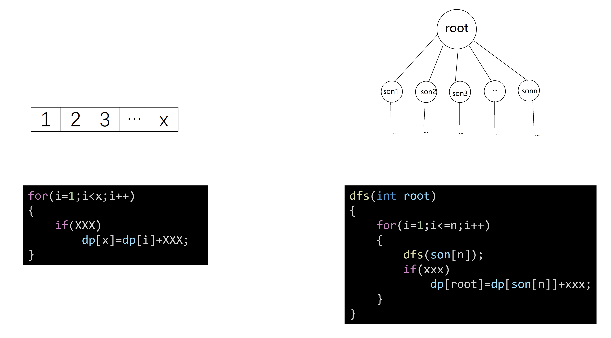

树形DP就是在树上进行的DP。

DP的本质是在局部求出子问题的最优解，再通过各子问题的解得到整个问题的解。

往常，我们做DP的题目，都是在数组这样的结构中进行“通过各子问题的解得到整个问题的解”这一操作。

在（有根）树这一结构中，子节点天然是父节点的子问题。所以树形DP的大致步骤就是：从树根开始，对于每一个节点，求出问题在它所有的子节点的子树上的解，再根据这些解，得出在当前节点的整个子树下的解。

由于需要访问各节点的整个子树，通常需要用到DFS来解决树形DP的题


接下来，我们用一道简单的题目来了解什么是树形DP，以及它是怎么实现的


### [洛谷P1532 没有上司的舞会](https://www.luogu.com.cn/problem/P1352)

某大学有 n个职员，编号为1~n。

他们之间有从属关系，也就是说他们的关系就像一棵以校长为根的树，父结点就是子结点的直接上司。

现在有个舞会，舞会每邀请来一个职员都会增加一定的快乐指数r_i。但是，如果某个职员的直接上司来参加舞会了，那么这个职员就无论如何也不肯来参加舞会了。

问：怎样邀请职员，能使快乐指数的总和最大。

----

不难想到，若一个人去了，那他的直接下属就都不会去；若一个人没去，他的直接下属则可以去也可以不去，应该看这个下属的子树是在他去的时候总快乐值更大，还是在他不去的时候总快乐值更大。

设：

 `dp[x][1]`为编号为x的人去参加时，他和他的下属总共能取得的最大快乐值

 `dp[x][0]`为编号为x的人不去参加时，他和他的下属（即x的整棵子树）总共能取得的最大快乐值

 n为x的直接下属的个数，`son[i]`为他的各直接下属。

若x去了，则x的各个直接下属都不会去，所以有

```c
for(i=0;i<n;i++)
    dp[x][1]+=dp[son[i]][0];
```

若x没去，x的各个直接下属可去可不去，所以应比较：他们是去的时候总快乐值比较大，还是不去的时候总快乐值比较大，即

```c
for(i=0;i<n;i++)
    dp[x][1]+=max(dp[son[i]][1],dp[son[i]][0]);
```

在执行上述步骤之前，需要先求出`dp[son][]`的值，为了做到这一点，上述步骤应该放在一个dfs里面，在执行上述步骤前，应先把son搜一遍，以求出`dp[son][]`，即

```c++
void dfs(int x)
{
    dp[x][0]=0;
    dp[x][1]=r[x];//将dp[x][1]的值预设为x的快乐值
    int n=node[x].son.size();
    for(int i=0;i<n;i++)
    {
        int son=node[x].son[i];
        dfs(son);//先搜索求出f[son]的值
        dp[x][1]+=dp[son][0];
        dp[x][0]+=max(dp[son][1],dp[son][0]);
    }
}
```

这就是DP的核心了。原题的整个代码也可以很容易地写出来

```c++
#include "bits/stdc++.h"
using namespace std;
int dp[6005][2];
struct Tree
{
    int r;
    vector<int> son;
    Tree()
    {
        while(!son.empty())
            son.pop_back();
    }
} node[6005];
void dfs(int x)
{
    dp[x][0] = 0;
    dp[x][1] = node[x].r;
    if(node[x].son.empty())
        return;
    int n = node[x].son.size();
    for(int i = 0; i < n; i++)
    {
        int son = node[x].son[i];
        dfs(son);
        dp[x][1] += dp[son][0];
        dp[x][0] += max(dp[son][0], dp[son][1]);
    }
}
int main()
{
    int n, i, root, a, b;
    scanf("%d", &n);
    memset(dp, 0, sizeof(dp));
    for(i = 1; i <= n; i++)
        scanf("%d", &node[i].r);
    root = 0;
    for(i = 1; i < n; i++)
    {
        scanf("%d%d", &a, &b);
        node[b].son.push_back(a);
        if(root == 0 || root == a)
            root = b;
    }
    if(n == 1)
        root = 1;
    dfs(root);
    if(dp[root][1] > dp[root][0])
        printf("%d\n", dp[root][1]);
    else
        printf("%d\n", dp[root][0]);
    return 0;
}
```


由这一题，我们可以得到树形DP解题核心代码的基本模板

```c++
void dfs(int x)
{
    dp[x][] = (...);//初始化
    if(node[x].son.empty())//到叶子就返回
        return;
    int n = node[x].son.size();
    for(int i = 0; i < n; i++)//枚举所有子节点，这里用邻接表存树
    {
        int son = node[x].son[i];
        dfs(son);
        (...)//状态转移
    }
}
```


在这一题中，题目给出的树是有根树，可以一眼看出父子结构，十分方便地进行DP。但有时候，题目中给出的树是没有指定根的无根树，这样的树也没有指定节点间的父子关系，不存在明显的子问题结构，不太方便进行树形DP。

但是，由于无根树的边一般都是无向边，只要任选一个树上的结点，假设它为根，使它变成一棵有根树，这样能够进行树形DP了。

下面要讲的树的重心与直径的求法，就是将无根树转化为有根树后做dp


## 树的重心

对于无根树上的每一个点，计算其所有子树中最大的子树节点数，这个值最小的点就是这棵树的重心。


这棵树的重心为3号点


这棵树的重心为1号点


这棵树的重心为1号点


那么，树的重心该怎么求呢？

任选一点为根（一般我用编号为1的点），从该点开始，往下遍历这棵树，求出各点的子树大小。

接下来，比较各点的各子树大小，找出最大子树最小的点即可。

**但是需要注意的是**，由于输入的树是无根树，我们只是以1为根，假设各点间具有父子关系，而实际上各点间是不存在父子关系的。

所以，当我们求各点的最大子树时，不能只算它的“子树”，还得将它“父亲方向”上的“子树”算上。

“父亲方向上的子树”大小即为 点的总数-所有子树所含点的总数-1

设`a[i]`为以i为根的树的大小，`b[i]`为以i为根形成的树的最大子树的大小，就能得到核心代码

```c++
void dfs(int x)
{
    a[x] = 1; //x的子树大小，预设为1（因为包含x本身）
    b[x] = 0; //x的最大子树大小，预设为0（因为不含x本身）
    int bsum = 0; //bsum为x的“子节点”的子树的大小之和
    for(int i = head[x]; i != -1; i = edge[i].nex) //我想你应该还记得链式前向星
    {
        if(i == parent[x]) //用parent标记已经走过的点（即以1为根的树中x点的祖先），以防重复访问
            continue;
        int son = edge[i].to;
        parent[son] = x;
        dfs(son);
        a[x] += a[son];
        if(b[x] < a[son])
            b[x] = a[son];

        bsum += a[son];
    }
    if(n - bsum - 1 > b[x]) //n为树中结点的总数，bsum为x的“子节点”的子树的大小之和，n-bsum-1即为x“父亲方向上”子树的大小
        b[x] = n - bsum - 1;
    if(max_son < b[x])
    {
        max_son = b[x];
        mx = x;
    }
}
```

树的重心还有一些性质，如：

一棵树可能有很多个重心

树的重心到树上所有点的距离之和最短

## 树的直径

无向树中，**所有最短路径距离的最大值**称为树的直径。

所谓最短路径，就是在不走回头路的情况下，从一个点走到另一个点的路径。

假设下列图中的边长都为1，则


这棵树的直径为5


这棵树的直径为3


这棵树的直径为3

那么，树的直径应该怎么求呢？

首先，按照求树的重心的操作，以点1为树根，往下搜索这棵树。

设`dp[x]`为x的子树中，离x距离最远的节点。`dp[x]`应该怎么求？

首先将`dp[x]`的值预设成0。之后对于x的每个子节点son，x到son的距离为dis，则有

```c
if(dp[root]<dis+dp[son])
    dp[root]=dis+dp[son];
```

然后，又要怎么根据这个值来求出直径？

不难想到，树的直径肯定是直径上的某个结点x到其子树中最长路径的值`dp[x]`，再加上x的另一个子节点的另一棵子树上的最大路径长这两个部分组成的。因此可以在求`dp[x]`的同时求直径长`diameter`的值，只需加入这两行代码

```c
if(diameter<dp[x]+dp[son]+dis)      
    diameter=dp[x]+dp[son]+dis;
```


于是又能得出完整的核心代码

```c++
int diameter=0;//直径应初始化为0
void dfs(int x)
{
    dp[x]=0;
    for(int e=head[x];e!=-1;e=edge[e].nex)
    {
        int son=edge[e].to,dis=edge[e].val;
        if(son==parent[x])
            continue;
        parent[son]=x;
        dfs(son);
        if(diameter<dp[x]+dp[son]+dis)//直径值的更新放在前面，保证完全枚举
            diameter=dp[x]+dp[son]+dis;
        if(dp[x]<dis+dp[son])
            f[x]=dis+f[son];
    }
}
```

由此，我们可以得到一份在无根树上做树形DP的通用模板

```c++
void dfs(int x)
{
    dp[x]=(...);//初始化
    for(int e=head[x];e!=-1;e=edge[e].nex)//枚举所有子节点。这里用链式前向星存树
    {
        int son=edge[e].to,dis=edge[e].val;
        if(son==parent[x])
            continue;
        parent[son]=x;
        dfs(son);
        (......)//根据子节点的dp值求该节点的dp值
    }
}
```


## 树+背包

和树结合的背包还是背包问题，但物品却以树形结构存储，不能任意取

一般的出题套路：若要往背包中放物品x，则需要先放物品y

一般的解法：转化为分组背包求解

接下来看一道经典例题

### [洛谷P2014 选课](https://www.luogu.com.cn/problem/P2014)

有 N 门功课，每门课有个学分，每门课有一门或没有直接先修课（若课程 a 是课程 b 的先修课，则只有学完了课程 a，才能学习课程 b）。

一个学生要从这些课程里选择 M 门课程学习，问他能获得的最大学分是多少？

------

如果没有“先修课”，本题就是典型的01背包问题。

但由于“先修课”的存在，本题不能自由选择上什么课。如果要上一节课，就得上它的先修课，还得上他先修课的先修课…

从局部最优解->整体最优解这一思路入手，默认这节课的先修课已经都选上了，求在以这节课为根的树上选课的最优选法即可。求出了在这棵子树上选课的最优选法后，再用这个最优解去推先修课的最优选法。

设`dp[x][k]`表示在以x为根的树上选k节课所能获得的最大学分，它的值由x的各子节点的`dp`值确定，即对于x的每个子节点`son`，都有

```c
if(dp[x][j]<dp[son][k]+dp[x][j-k])
    dp[x][j]=dp[son][k]+dp[x][j-k];
```

这实际上把问题分组后，转化成了01背包问题。把代码套进第一题整理出来的模板，就能得到

```c++
void dfs(int x)
{
    dp[x][0]=0;
    dp[x][1]=node[x].val;//若在x的子树中只选一个点，自然只选x本身
    int n=node[x].son.size(),i,j,k;
    for(i=0;i<n;i++)
    {
        int son=node[x].son[i];
        dfs(si);
        for(j=m;j>0;j--)//为什么要倒序？
        {
            for(k=0;k<j;k++)
            {
                if(dp[x][j]<dp[son][k]+dp[x][j-k])
                    dp[x][j]=dp[son][k]+dp[x][j-k];
            }
        }
    }
}

```

完整的代码如下。还需要注意一点就是：输入的数据形成的可能是个森林。所以我们假设课程0为所有没有前置课程的课都要选的课，强制把0选上，这样就可以把森林连结在一起了。由于多选了“0号课程”，允许选的最大课程数m也要+1。

```c++
#include "bits/stdc++.h"
using namespace std;
struct Tree
{
    int val = 0;
    vector<int> son;
} node[305];
int dp[305][305], m;
void dfs(int x)
{
    dp[x][0] = 0;
    dp[x][1] = node[x].val;
    int n = node[x].son.size(), i, j, k;
    for(i = 0; i < n; i++)
    {
        int son = node[x].son[i];
        dfs(son);
        for(j = m; j > 0; j--) //为什么要倒序？
        {
            for(k = 0; k < j; k++) //为什么是k<j?
            {
                if(dp[x][j] < dp[son][k] + dp[son][j - k])
                    dp[x][j] = dp[son][k] + dp[son][j - k];
            }
        }
    }
}
int main()
{
    int n, i, k, s;
    memset(dp, 0, sizeof(dp));
    scanf("%d%d", &n, &m);
    for(i = 1; i <= n; i++)
    {
        scanf("%d%d", &k, &s);
        node[k].son.push_back(i);
        node[i].val = s;
    }
    m++;//因为把0设为了树根，所以m要+1
    dfs(0);
    printf("%d\n", dp[0][m]);
    return 0;
}
```


## 总结

一般有根树上DP的核心代码（邻接表）

```c++
void dfs(int x)
{
    dp[x][] = (...);//初始化
    if(node[x].son.empty())//到叶子就返回
        return;
    int n = node[x].son.size();
    for(int i = 0; i < n; i++)//枚举所有子节点，这里用邻接表存树
    {
        int son = node[x].son[i];
        dfs(son);
        (...)//状态转移
    }
}
```

无根树上DP核心代码（链式前向星）

```c++
void dfs(int x)
{
    dp[x]=(...);//初始化
    for(int e=head[x];e!=-1;e=edge[e].nex)//枚举所有子节点。这里用链式前向星存树
    {
        int son=edge[e].to,dis=edge[e].val;
        if(son==parent[x])//将son的父亲设为x
            continue;
        parent[son]=x;
        dfs(son);
        (......)//根据子节点的dp值求该节点的dp值
    }
}
```


## 题单

| 题目序号 | 题目出处  | 题目类型     | 题目难度 |
| -------- | --------- | ------------ | -------- |
| 1        | POJ 1655  | 树的重心     | ⭐⭐       |
| 2        | POJ 2631  | 树的直径     | ⭐⭐       |
| 3        | POJ 1463  | 基础树形DP   | ⭐        |
| 4        | POJ 1192  | 基础树形DP   | ⭐⭐⭐      |
| 5        | HDU 1561  | 树形背包     | ⭐⭐⭐      |
| 6        | 洛谷P1352 | 基础树形DP   | ⭐        |
| 7        | 洛谷P1273 | 树形背包     | ⭐⭐⭐⭐⭐    |
| 8        | 洛谷P2014 | 树形背包模板 | ⭐⭐⭐      |
| 9        | 洛谷P2015 | 树形背包     | ⭐⭐⭐⭐     |
| 10       | 洛谷P1122 | 基础树形DP   | ⭐⭐⭐      |


## 参考资料

《信息学奥赛一本通·提高篇》

[树的重心 - OI Wiki (oi-wiki.org)](https://oi-wiki.org/graph/tree-centroid/)

[树的直径 - OI Wiki (oi-wiki.org)](https://oi-wiki.org/graph/tree-diameter/)

[【动态规划4】树与图上的动态规划 - 题单 - 洛谷 | 计算机科学教育新生态 (luogu.com.cn)](https://www.luogu.com.cn/training/214#problems)