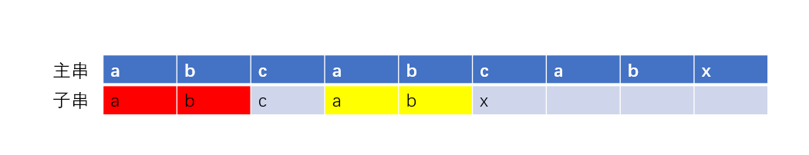

## AC自动机

~~ac自动机，写了就ac~~

大家不必被这个名字吓到，其实真的不难

[AC自动机.pdf](https://github.com/CSGrandeur/s-1problem1day1ac/files/7027706/AC.pdf)
 【腾讯文档】AC自动机
https://docs.qq.com/slide/DRW5kZFZic1ZZT3p4


### 1.前置知识

AC自动机其实就是**字典树**+**`kmp`​思想**的一个算法，但是讲道理，ac自动机比`kmp`​简单的多

#### 1.1字典树

对于AC​自动机，要求字典树全掌握

[参考](https://github.com/CSGrandeur/s-1problem1day1ac/discussions/50)

字典树，又可称为`trie`树、前缀树、单词查找树。前缀树这个名称最为形象的描述了其原理：将不同单词的相同前缀合并到一起。

下图举例建树{`aaaa,aabc,bac,aca`​​​​}​​


从上图我们可以清晰看出：

1. 根节点并不包含字符，除了根以外的结点都仅包含一个字符
2. 从根到某个子节点的**路径**，代表着一个字符串
3. 每个节点的所有子节点包含的字符都不相同

由第三点可以看出，其实字典树就是26叉树

为了统一，我们可以对字典树中的字符进行编码：


编码的时候当然是按照插入单词的顺序编码了，如果子节点对应字符不存在，便提供一个新的编码来创建该子节点

这里仅给出插入的模板

```C++
#include <string>
#include <iostream>
using namespace std;
const int maxn = 1e5 + 10;
const int alp = 26;  // 此处是全为小写字母建树，建议将alp作为一个常量，之后的代码就不用一个个改
int trie[maxn][alp]; // 字典树，trie[i][j] = x,表示i号结点的第j个子节点的编号是x
int tp = 0;

void insert(string s)
{
    int now = 0;
    for (int i = 0; i < s.length(); i++)
    {
        int next = s[i] - 'a'; // 第next个子节点
        if (trie[now][next] == 0)
            trie[now][next] = ++tp; // 如果该子节点不存在，则分配一个编号
        now = trie[now][next];      // 当前子节点往下一层走
    }
}
```


#### 1.2.`kmp`​思想

`kmp`​算法用于单个字符串匹配，如给出一个主串和一个子串，问子串是否在主串中出现

朴素算法的复杂度为`O(nm)`​，`n`为主串长，`m`为子串长

`kmp`​算法通过next数组将复杂度降为`O(n+m)`​​​，原理是通过子串的最大相等前后缀，将失配位置的字符指向该字符前方有可能匹配的位置

举例：

主串：`abcabcabx`​​​​​​​			子串：`abcabx`​​​​​​​​


子串第一次匹配的时候，最后的`c`和`x`失配，因此，子串应该继续向后挪，但是怎么挪？

经过观察我们发现，子串失配前的部分`abcab`​​有相同的前后缀`ab`​​



即红色部分与黄色部分是相同的前后缀，看图可知，如果后面的`ab`​与主串匹配，那么把前面的`ab`​挪过来之后，必然与主串匹配


总结发现，我们可以在失配位置上，提供一条路径，让子串在失配时跳转，模拟把子串挪过来的过程，以上图为例，即：


理论上子串每个字符都应该有失配指向，而这里仅画了一个字符的

想学习`kmp`算法，还有许多细节需要学习，但如果是学习AC自动机，学到这里便是足够


### 2.AC自动机引出

AC自动机是一种多模匹配算法（多字符串匹配）

[AC自动机讲解超详细](https://www.cnblogs.com/hyfhaha/p/10802604.html)：适合入门，代码不是很好看

[AC算法详解](https://blog.csdn.net/joylnwang/article/details/6793192)：这个写的挺严谨，适合巩固

#### 2.1.问题

给出一个主串，给出若干个子串，问主串中有多少个子串出现			[地址](https://www.luogu.com.cn/problem/P3808)

1. 朴素算法

   直接把每一个子串拉上去匹配，复杂度`O(nmx)`​​，n为主串长，m为子串个数，x为子串平均长度

2. 用`kmp`​​​​算法

   将每个子串都用下`kmp`​​，复杂度为`O(nm)`​​

#### 2.2.建图

经过思考，我们发现，现已有的工具仅能把复杂度压缩到`O(n*m)`​​，复杂度主要是在m个子串查询上，因为主串扫一次是必要的

那么有什么办法可以将m个子串，合并到一起，然后扫一次主串就好呢？

我们想到了**字典树**，当然仅用字典树肯定不够，但我们可以先尝试

举例：主串为`aabcef`​		子串为`aaer,aabb,abcf,bcef`​

于是！建图！匹配！


当匹配到主串的c时，失配


#### 2.3.`fail`​​指针​​（失配指针）

但是仔细观察主串，发现已匹配的部分`aab`​​​​​​​​​​，其后缀`ab`​​​​​​​​​​与其中一个子串`abcf`​​​​​​​​​​的前缀`ab`​​​​​​​​​​相同，那么我们可以结合先前所学的`kmp`​​​​​​​​​​思想，将子串中失配**结点的父节点**`5b`​​​​​​​​​​跳转到**前缀相同的最后一个字母**`7b`​​​​​​​​​​中去，即：​


由此我们可以看出如果一个子串`(aabb)`​​的任意前缀`(aab)`​​的后缀`(ab)`​​，与另一个子串`(abcf)`​​的前缀`(ab)`​​相同，则可以跳转，我们把这个跳转的指向称为**`fail`​​​指针**（为防止大家晕，加了上述的例子在括号内）

或许会疑惑，之前的`kmp`​​​不都是从失配的地方开始跳转（`6b`​​​->`8c`​​​​​），为什么这次要从**失配的父节点**开始跳转？

因为在用字典树从上往下匹配的时候，失配的情况=找不到相应的子节点，因此是不会落到子节点去的。


#### 2.4.如何构建`fail`​指针？

以上图的`5b`​​​​为例，如果把其父节点`2a`​​的`fail`​​​​指针补充完整，恰好发现，`5b`​所指向的`7b`​恰好是其父节点`2a`​所指向的节点`1a`​​的**对应位置**的子节点`7b`​​


那么我们可以这样认为，只要把最上层的`fail`​指针构造好了，那下层就可以根据其父亲的`fail`​指针来构造自己的`fail`​​指针

于是，我们规定：

1. 根及根的所有子节点的`fail`​指针都指向根，即根和第一层的节点全都指向根
2. 节点`x`​​​​​的`fail`​​​​​指针指向`y`​​​​​(非根)，那么**x的t​​子节点**的`fail`​​​​​指针指向**y​​的t​​​​子节点**的`fail`​​​，即找父节点的`fail`​​​​指向的节点的**对应位置**子节点

对应位置指的是节点代表的值相同，`fail`​​​指针指向的节点除了是根以外，必须与本身的值相同

如果跳转一次`fail`​指针之后，找不到对应位置的子节点，那么就**继续跳转`fail`​**，直到跳转到**根**为止


我们在构造`fail`​​​指针通常以广搜bfs的方式进行，从上往下一层一层地构造

同时由于我们在建造字典树的时候，会发现字典树只能自上而下地查询，即我们无法查询一个节点的父节点是什么，因此在建造`fail`​指针的时候，都是建造当前节点的**所有子节点**的`fail`​​​指针

模板

```C++
#include <iostream>
#include <cstdio>
#include <queue>
using namespace std;
const int maxn = 1e5 + 10;
const int alp = 26;
int trie[maxn][alp];
int fail[maxn];

void getfail()
{
    queue<int> ans;              // bfs
    fail[0] = 0;                 // 根的fail也是指向根，虽然根的fail完全用不到
    for (int i = 0; i < 26; i++) // 第一层节点的fail初始化为根
    {
        if (trie[0][i])
        {
            ans.push(trie[0][i]);
            fail[trie[0][i]] = 0;
        }
    }

    while (!ans.empty())
    {
        int now = ans.front();
        ans.pop();
        for (int i = 0; i < 26; i++) // 建造当前节点的所有子节点的fail指针
        {
            if (trie[now][i])
            {
                ans.push(trie[now][i]);
                int u = fail[now];           // 父节点的fail指向的结点
                while (u && trie[u][i] == 0) //（针对于父节点的fail指向的结点）无对应字母的子节点情况，继续跳转fail，直到根
                {
                    u = fail[u];
                }
                fail[trie[now][i]] = trie[u][i];
            }
        }
    }
}
```

**为什么不用dfs而是用bfs？**

因为会有`fail`​指向的结点没有相对应的子节点的情况发生，以子串{`abcd,bc,cd`​​}的情况，如果dfs从以`abcd,bc,cd`​的过程开始建造`fail`​指针，会发现`abcd`​的`d`​实际上是指向根，但理应指向`cd`​的`d`​

在构造`fail`​​​指针的时候，会不断地跳转`fail`​​​​，而bfs可以保证，比当前节点低层的`fail`​​​指针已经全部构造好


这里给出`fail`​指针全部构造好的图，如果没有画的，说明指向根


#### 2.5.查询

当明白了如何构建`fail`​​​指针之后，对主串的匹配反而是一件很简单的事情，我认为是纵向和横向并行（我自己造的，能理解就好）

纵向：和`kmp`的匹配类似，在字典树中从根开始往下匹配，如果失配就跳转`fail`​，直到找到匹配的，才停止跳转`fail`​，如果一直没有跳转到匹配的，最后肯定会回到根的

横向：AC自动机是多字符串匹配，因此除了一路地往下匹配，还需要跳转到其他字符串的匹配，举例：{`abcd,bc`​​​​}为子串，`abcdef`​​​​为主串，你在主串匹配至`c`​​​​的时候，会发现子串`bc`​​​​也匹配，而仅仅纵向地匹配，就只是在子串`abcd`​​​​上匹配，会忽略子串`bc`​​​​​，因此，在字典树每一个字符匹配的时候，都要跳转`fail`​​​指针，寻求其他字符串有没有可能匹配（可以理解为，**当前子串的后缀有与其他子串的前缀相等的情况**），直到跳转到根为止

**横向的`fail`​​跳转不会变成一个圈，进入死循环吗？**

上述提及横向跳转时子串匹配的情况等价于**当前子串的后缀有与其他子串的前缀相等的情况**，我们可以知道，当前子串一定比匹配的其他子串前缀还长，所以`fail`​​指针，永远跳转向低层的节点，最后到根，这也是为什么用`bfs`的原因​

下面给出该问题的代码

```C++
#include <iostream>
#include <cstdio>
#include <string>
#include <queue>
using namespace std;
const int maxn = 1e6 + 10;
const int alp = 26;
int tp = 0;
int trie[maxn][alp] = {0}; // 字典树
int fail[maxn];
int cntword[maxn] = {0}; // cntword[i] = x，表示当前节点是多少个单词的末尾

// 构建字典树
void insert(string s)
{
    int now = 0;
    for (int i = 0; i < s.length(); i++)
    {
        int next = s[i] - 'a';
        if (trie[now][next] == 0)
            trie[now][next] = ++tp;
        now = trie[now][next];
    }
    cntword[now]++; // 标记单词末尾
}

// 构造fail指针
void getfail()
{
    queue<int> temp;              // bfs
    fail[0] = 0;                  // 根的fail也是指向根，虽然根的fail完全用不到
    for (int i = 0; i < alp; i++) // 第一层节点的fail初始化为根
    {
        if (trie[0][i])
        {
            temp.push(trie[0][i]);
            fail[trie[0][i]] = 0;
        }
    }

    while (!temp.empty())
    {
        int now = temp.front();
        temp.pop();
        for (int i = 0; i < alp; i++) // 建造当前节点的所有子节点的fail指针
        {
            if (trie[now][i])
            {
                temp.push(trie[now][i]);
                int u = fail[now];           // 父节点的fail指向的结点
                while (u && trie[u][i] == 0) //（针对于父节点的fail指向的结点）无对应字母的子节点情况，继续跳转fail，直到根
                {
                    u = fail[u];
                }
                fail[trie[now][i]] = trie[u][i];
            }
        }
    }
}

// 查询
int query(string ss)
{
    int now = 0;
    int ans = 0; // 单词数
    for (int i = 0; i < ss.length(); i++)
    {
        int next = ss[i] - 'a';
        while (now && trie[now][next] == 0) // 纵向查询
            now = fail[now];
        now = trie[now][next];

        //横向查询
        for (int j = now; j && cntword[j] != -1; j = fail[j]) // cntword[j]!=-1,被查询标记过的单词无需再跳转
        {
            ans += cntword[j];
            cntword[j] = -1; // 已经查询过的单词就标记
        }
    }
    return ans;
}

int main()
{
    int n;
    scanf("%d", &n);
    for (int i = 0; i < n; i++)
    {
        string s;
        cin >> s;
        insert(s);
    }
    getfail();
    string ss;
    cin >> ss;
    cout << query(ss) << endl;
}
```


### 3.优化

#### 3.1.trie图优化

[AC快乐机——最最通俗易懂的AC自动机讲解！](https://blog.csdn.net/WADuan2/article/details/80688515)：这个的`trie`图讲解可以的，他的图也通俗易懂

上述构建`fail`​​​指针的时候，我们发现跳转一次`fail`​找不到对应子节点后，就要继续跳转`fail`​​​，那么，要是这个操作无限变多，就会浪费大量时间，不只是构造的时候浪费时间，查询的时候一样浪费时间，如下图：子串{`abcdef,bcde,cde,de,e,f`​}


左下角的`e`​要连接到右上角的`f`​经过了若干次的`fail`​跳转，这相当消耗时间

我们考虑将这些未找到相应位置的`fail`​指针的查询结果，强行建立在字典树中，就可以简化查询和构造`fail`​的跳转次数，即：


可以把虚化的`f`​理解为，是右上角的`f`​的分身，即，一进入虚化的`f`​，就立刻跳转到右上角的`f`​​中去

如果你理解了上述行为，就会发现`trie`图的构造其实就是把`fail`​​指针的结果储存下来而已

代码更改：

```C++
// 构建fail
void getfail()
{
    queue<int> temp;
    for (int i = 0; i < alp; i++)
    {
        int u = trie[0][i];
        if (u)
        {
            temp.push(u);
            fail[u] = 0;
        }
    }

    while (!temp.empty())
    {
        int now = temp.front();
        temp.pop();
        for (int i = 0; i < alp; i++) // 对每个子节点都进行构建
        {
            int u = trie[now][i];
            if (u) // 如果该子节点存在，就直接构建fail
            {
                temp.push(u);
                fail[u] = trie[fail[now]][i];
            }
            else // 如果该子节点不存在，就构建分身->（（当前节点的父节点）的fail指向的点）的对应位置子节点
                trie[now][i] = trie[fail[now]][i];
        }
    }
}

// 查询
int query(string s)
{
    int now = 0;
    int ans = 0;
    for (int i = 0; i < s.length(); i++)
    {
        int next = s[i] - 'a';
        now = trie[now][next]; // 不用再考虑是否跳转到无对应子节点的父节点的情况，有分身的存在，直接跳就OK
        for (int j = now; j && cntword[j] != -1; j = fail[j])
        {
            ans += cntword[j];
            cntword[j] = -1;
        }
    }
    return ans;
}
```

`trie`图的优化着实牛逼，他不仅省时间，而且代码还短了点，不容易写错，这边建议大家一律写这种，前面那种普通的就当做理解就好


#### 3.2.拓扑优化

[问题](https://www.luogu.com.cn/problem/P3796)：给出一个文本串（主串）和`n`个模式串（子串），求出现次数最多的模式串

因为是要查询次数，所以横向查询时就不需要标记是否查询过

```C++
struct node
{
    int word_id; // 第几个单词
    int times;   // 出现了几次
} ans[maxn];

// id[i],是用来标记单词末尾
void query(string s)
{
    int now = 0;
    for (int i = 0; i < s.length(); i++)
    {
        int next = s[i] - 'a';
        now = trie[now][next];
        for (int j = now; j; j = fail[j]) // 终止条件为到了根
        {
            int u = id[j];
            if (u)
                ans[u].times++;
        }
    }
}
```

妥妥的AC自动机，弄上去就过了


[数据强化](https://www.luogu.com.cn/problem/P3796)：你会发现一样的方法就超时了

[参考](https://www.luogu.com.cn/blog/juruohyfhaha/solution-p5357)

仔细研究后发现，是因为多了一些很恶心的子串，例如`a,ba,cba,dcba,edcba`​这一类的子串

我们仔细观察，其复杂度仍然是`o(n*m)`​​，而复杂度没有被降下来的主要问题是`query()`​​操作的时候，因为每次跳转`fail`​​操作的时候，仅**仅跳转了一层**，导致跳转`fail`​​的次数过多，因此我们考虑删去该过程，然后在完成`query()`​​之后进行**统一地层层叠加**上去

因此我们很容易想到了拓扑排序，以拓扑排序的方式叠加上去，就能省去不断跳转`fail`​的过程。显然，由`fail`​​​指向形成的图，必然是有向无环图`(DAG)`

代码如下：

```C++
#include <iostream>
#include <cstdio>
#include <queue>
#include <string>
using namespace std;
const int maxn = 2e5 + 10;
const int alp = 26;
int trie[maxn][alp] = {0};
int fail[maxn] = {0};
int id[maxn];
int vis[maxn] = {0};
int times[maxn] = {0};
int tp = 0;
string ss[maxn];
string sss;
int in[maxn];

void init()
{
    for (int i = 0; i < alp; i++)
    {
        for (int j = 0; j <= tp; j++)
            trie[j][i] = 0;
    }

    for (int i = 0; i <= tp; i++)
        in[maxn] = times[i] = fail[i] = id[i] = vis[i] = 0;

    tp = 0;
}

void insert(int num, string s)
{
    int now = 0;
    for (int i = 0; i < s.length(); i++)
    {
        int next = s[i] - 'a';
        if (trie[now][next] == 0)
            trie[now][next] = ++tp;
        now = trie[now][next];
    }
    vis[now] = 1;
    id[num] = now;
}

void getfail()
{
    queue<int> temp;
    for (int i = 0; i < alp; i++)
    {
        int u = trie[0][i];
        if (u)
        {
            temp.push(u);
            fail[u] = 0;
        }
    }

    while (!temp.empty())
    {
        int now = temp.front();
        temp.pop();
        for (int i = 0; i < alp; i++)
        {
            int u = trie[now][i];
            if (u)
            {
                temp.push(u);
                fail[u] = trie[fail[now]][i];
                in[trie[fail[now]][i]]++;
            }
            else
                trie[now][i] = trie[fail[now]][i];
        }
    }
}

void query(string s)
{
    int now = 0;
    for (int i = 0; i < s.length(); i++) // 仅剩下纵向查询
    {
        int next = s[i] - 'a';
        now = trie[now][next];
        times[now]++;
    }
}

// 通过fail指针形成的有向图，进行拓扑叠加(拓扑也是我讲的，谁要是不会自己回去看！)
void topu()
{
    queue<int> temp;
    for (int i = 1; i <= tp; i++)
    {
        if (in[i] == 0)
            temp.push(i);
    }

    while (!temp.empty())
    {
        int now = temp.front();
        temp.pop();
        int next = fail[now];
        times[next] += times[now];
        in[next]--;
        if (in[next] == 0)
            temp.push(next);
    }
}

int main()
{
    int n;
    cin >> n;
    for (int i = 0; i < n; i++)
    {
        cin >> ss[i];
        insert(i, ss[i]);
    }
    getfail();
    cin >> sss;
    query(sss);
    topu();
    for (int i = 0; i < n; i++)
        cout << times[id[i]] << endl;
}
```


### 4.题集

[参考 CSDN](https://blog.csdn.net/yew1eb/article/details/38011197)

[参考 洛谷](https://www.luogu.com.cn/training/60465#problems)

| 序号 |     题号      |              标题              |    题型    | 题目难度 |
| :--: | :-----------: | :----------------------------: | :--------: | :------: |
|  1   |  洛谷 P3808   |   【模板】AC自动机（简单版）   | 字符串匹配 |    1     |
|  2   |   HDU 2222    |        Keywords Search         | 字符串匹配 |    1     |
|  3   |   HDU 2896    |            病毒侵袭            | 字符串匹配 |    1     |
|  4   | SPOJ WPUZZLES |          Word Puzzles          | 字符串匹配 |    3     |
|  5   |  洛谷 P3796   |   【模板】AC自动机（加强版）   | 字符串计数 |    2     |
|  6   |   HDU 3065    |         病毒侵袭持续中         | 字符串计数 |    2     |
|  7   |  洛谷 P5357   | 【模板】AC自动机（二次加强版） | 字符串计数 |    3     |
|  8   |   ZOJ 3228    |      Searching the String      | 字符串计数 |    3     |


### 参考资料汇总：

1. [字典树](https://github.com/CSGrandeur/s-1problem1day1ac/discussions/50)
2. [AC自动机讲解超详细](https://www.cnblogs.com/hyfhaha/p/10802604.html)：适合入门，代码不是很好看
3. [AC算法详解](https://blog.csdn.net/joylnwang/article/details/6793192)：这个写的非常严谨，适合巩固
4. [AC快乐机——最最通俗易懂的AC自动机讲解！](https://blog.csdn.net/WADuan2/article/details/80688515)：这个的`trie`图讲解可以的，他的图也通俗易懂
5. [拓扑优化参考](https://www.luogu.com.cn/blog/juruohyfhaha/solution-p5357)
