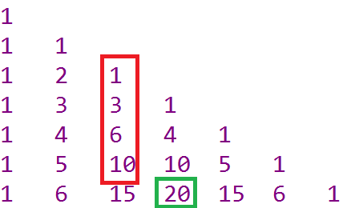
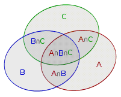

## 前言

本文介绍的内容是关于组合数学和概率方面的一些内容，提到组合数学，大家可能多多少少都有一些印象或者基础，高中的时候也应该练习过不少组合数学相关的题目，当然，如果往深了追究，组合数学包含的内容远不是这一篇文章可以说清楚的，本文意在帮助大家复习或者学习在ACM竞赛中，我们经常会遇到的组合数学问题和对应的解法。

## 目录

#### 一.组合数学

##### 1.加法原理

##### 2.乘法原理

##### 3.排列组合的基础性质

##### 4.组合数的几种常见求法

##### 5.常见的计数技巧

##### 6.二项式定理

##### 7.多重集的排列组合

##### 8.卡特兰数等特殊数列

##### 9.容斥原理

##### 10.抽屉原理

#### 二.概率

##### 1.概率和数学期望的定义

##### 2.一些概率常见性质

##### 3.概率dp入门

#### 三.生成函数（母函数）

##### 1.普通型生成函数

##### 2.指数型生成函数


## 一.组合数学

#### 1.加法原理

加法原理是分类计数原理，常用于排列组合中，具体是指：做一件事情，完成它有n类方式，第一类方式有M1种方法，第二类方式有M2种方法，……，第n类方式有Mn种方法，那么完成这件事情共有M1+M2+……+Mn种方法。

举个简单的例子：从武汉到上海有乘火车、飞机、轮船3种交通方式可供选择，而火车、飞机、轮船分别有k1，k2，k3个班次，那么从武汉到上海共有 k1+k2+k3种方式可以到达。

#### 2.乘法原理

做一件事，完成它需要分成n个步骤，做第一 步有m1种不同的方法，做第二步有m2种不同的方法，……，做第n步有mn种不同的方法。那么完成这件事共有 N=m1×m2×m3×…×mn 种不同的方法。 和加法原理是数学概率方面的基本原理。

同样我们也用一个例子来说明这个问题，从武汉到上海我们要先坐火车到北京，再从北京坐飞机到深圳，最后从深圳坐轮船到上海，而火车、飞机、轮船分别有k1，k2，k3个班次，那么从武汉到上海共有 k1* k2*k3种方式可以到达。

他们之间最大的区别就是，加法原理解决的是分类问题，乘法原理解决的是分步问题。

#### 3.排列组合的性质

##### 排列组合的定义

排列（permutation）从n个不同元素中每次取出m（1≤m≤n）个不同元素，排成一列，称为从n个元素中取出m个元素的无重复排列或直线排列，简称排列。从n个不同元素中取出m个不同元素的所有不同排列的个数称为排列种数或称排列数，用符号记为A。运算公式如下
$$
A_n^m=\frac{n!}{(n-m)!}=n*(n-1)*...*(n-m+1)
$$
组合（combination），数学的重要概念之一。从n个不同元素中每次取出m个不同元素（0≤m≤n），不管其顺序合成一组，称为从n个元素中不重复地选取m个元素的一个组合。所有这样的组合的总数称为组合数，这个组合数用符号记为C，运算公式如下
$$
C_n^m=\frac{n!}{m!(n-m)!}=\frac{n*(n-1)*...*(n-m+1)}{m*(m-1)*...*2*1}
$$


##### 排列数和组合数的常用性质

$$
A_n^m=nA_{n-1}^{m-1}
$$

这个性质就可以理解为我们先把某个特定位置安排好数，在对其他位置进行排列
$$
C_n^m=C_{n}^{n-m}\\
C_n^m=C_{n-1}^{m}+C_{n-1}^{m-1}\\
C_n^0+C_n^1+C_n^2+...+C_n^n=2^n
$$
分别来简单理解或者证明一下这几个性质，首先对于性质1，我们直接从定义出发，每次我们从n中选m个元素组成一个集合的同时，剩余元素也自动组成了一个组合，这二个集合一一对应。所以性质1成立。对第二个性质，我们可以把问题看作从n个不同元素中取出m个元素分为2类，一个是选择n号元素，一个是不选择n号元素。如果选择n号元素。剩下的部分只需要在n-1个元素中选择m-1个元素即可。如果不选择n号元素，就需要从n-1个元素中选择m个元素。因为这是分类问题，根据加法原理，性质二也成立。性质三就是从n个元素中选择若干个元素组成1个集合，一共有n+1种方法。也就是从n中取出0，1...n个元素。换个角度来想，对于n个元素，我们看作每个元素可以选也可以不选2种状态，也就是二进制组成它的所有选择情况，两种方法得到的值应该相等，所以性质三正确。

##### 全排列

提到排列我们就顺便介绍一下排列的特殊情况，全排列。从n个元素中取出n个元素排列。排列方法一共有n!种。在algorithm库中我们可以调用函数

 `next_permutation()` 函数，自动产生当前某数组的下一种全排列的方式。

```CPP
 sort(a,a+n);
    do{
        for(int i=0;i<n;i++)
            printf("%d ",a[i]);
        printf("\n");
    }while(next_permutation(a,a+n));
```

这是比较常见的枚举全排列的做法。

### 4.组合数的几种常见求法

#### 1.杨辉三角递推求组合数

组合三角的值刚好等于杨辉三角的值，例如图中的20代表的就是从6个数种选3个数组合数。这个表的行和列都从0开始记。



```CPP
for(int i=0;i<=n;i++){
	c[i][0]=c[i][i]=1;
	for(int j=1;j<i;j++)
		c[i][j]=(c[i-1][j]+c[i-1][j-1])%mod;
}
```

#### 2.加速递推求组合数

如果我们不想打出完整的表，只想通过O(n)来得到组合数我们可以利用公式
$$
C_n^m=\frac{n-m+1}{m}*c_n^{m-1}
$$
有了这个公式，我们相求某个位置的组合数的值就可以O（n）递推得到了

```CPP
c[0] = 1;
for(int i = 1 ; i * 2 <= n ; i ++ ) 
	c[i] = c[n-i] = ( n - i + 1 ) * c[ i - 1 ] / i;
```

这里还用了组合数的性质1进行优化。

#### 3.公式法求组合数

其实上一种情况也式基本用公式得到的，这里我们还是一样，预处理出很多数的阶乘然后直接套公式求组合数就行。但是这个问题有着一个致命的缺陷。就是，如果数字过大，要求进行取模操作，那么我们不能在模意义下直接进行除法，那么怎样解决这个问题呢。其实也很容易就能想到，求下逆元就好了。如果模数式质数，我们直接费马小定理求逆元就好了。如果不是质数就用扩展欧几里得法来求逆元。总之可以在O（logn）内完成查询，

```CPP
int pow(int x,int y){
	int res=1;
	x%=p;
	for(;b;b>>=1,a=a*a%p) if(b&1) res=res*a%p;
    return res;
}
int inv(int x,int p){ //求逆元
	return pow(x,p-2);
}
int main()
{
    int n,m,ans;
    scanf("%d%d",&n,&m);
    fac[0]=1;
	for(int i=1;i<=n;i++)
		fac[i]=fac[i-1]*i; //预处理出阶乘
	ans= ((fac[n]*inv(fac[m],p))%p*inv(fac[n-m],p))%p;
}
```

#### 4.Lucas定理求组合数

如果当组合数的底很大，但是模数是一个小质数的时候，我们不能用O（n）的复杂度处理阶乘的时候，我们可以用Lucas定理来迭代这个式子，让式子的复杂度降低。 

Lucas定理为
$$
C_n^mmodp=C_{n/p}^{m/p}∗C_{n\quad modp}^{m\quad modp}\quad modp
$$
这里用一道例题来帮助大家理解这个过程 洛谷P3807

```CPP
#define int long long
int t,n,m,p,f[100005];
int pow(int a, int b, int mod)
{
    int res = 1;
    while(b) {
        if(b & 1) res = res * a % mod;
        a = a * a % mod;
        b >>= 1;
    }
    return res;
}
int C(int n,int m,int p){ //求组合数
	if(m>n) return 0;
	return ((f[n]*pow(f[m],p-2,p))%p*pow(f[n-m],p-2,p)%p);
}
int lucas(int n,int m,int p){ //Lucas定理
	if(!m) return 1;
	return C(n%p,m%p,p)*lucas(n/p,m/p,p)%p;
}
signed main(){
	scanf("%d",&t);
	while(t--){
		scanf("%d%d%d",&n,&m,&p);
		f[0]=1;
		for(int i=1;i<=p;i++)
			f[i]=(f[i-1]*i)%p;
		printf("%lld\n",lucas(n+m,m,p));
	}
}
```

### 5.常见的计数技巧

##### 1.整体法（捆绑法）

在计数时，当要求某些元素必须相邻时，先把他们看作一个整体，然后把所有整体都当成一个个元素和剩余元素一起考虑计数。要注意：整体内部也有顺序，也要乘上整体内部的排列数。

##### 例题

ABCDE 五个人要排队，A和 B要相邻， C 和 D 要相邻，求一共有多少种排列方法。

首先将 AB,CD分别看成一个整体，然后变成 3 个元素的全排列问题， 方案数为 3!=6，然后考虑 AB，CD 内部的相对顺序，共有 6*2 *2=24种方案

##### 2.插空法

当要求若干元素两两不相邻时，可以先将其他元素放好，然后将这些元素插入空隙或者序列两端当中，进行计数。

##### 例题

ABCDEFG 七个人要排队ABC 三个人两两不相邻，求方案数。 

先将剩下四个人排好，有 4 ! = 24 种方案，然后将ABC 三个人插入5 个空当中，在五个空挡种选三个，用排列做，在用乘法原理把结果相乘

答案就是24*A（5，3）=1440种方案。

##### 例题

一张节目表上有 3 个节目，保持其相对顺序不变，再加入 2 个新节目，有多少种方案？

可以结合整体法和插空法。分为两种情况，如果两个新节目相邻，我们把他们看作整体，3个节目有4个空，在让2个节目内部排列的方案数是
$$
C_4^1*A_2^2
$$
如果两个节目不相邻，就把两个节目插入4个空中方案是
$$
A_4^2
$$
最后答案就是两种情况相加。

##### 3.隔板法

在解决若干相同元素分组问题时，若要求分为 m 组，其中每组至少一个元素，则可以转化为在排成一列的这些元素中插入m−1 个 “ 隔板 ” ，达到分组目的。


##### 例题

*n* 个小球放到 m 个盒子里，如果要求每个盒子不为空，一共有多少种方案，如果允许盒子为空，有多少种方案？

首先考虑不允许空的情况。首先将这 n 个小球摆成一排，从左往右依次插入m−1 块隔板，代表每 个盒子分到的部分，即每种插板的方案和原来的每一种分配方案是一一对 应的，m−1块隔板插入n−1 个空当中（因为要求非空所以不能插在最左和最右位置）方案为
$$
C_{n-1}^{m-1}
$$
那么如果盒子允许为空，我们可以先假设每个盒子已经放过1个球，然后把问题转化为不允许空的情况。也就是把n+m个小球摆好然后插入m-1个隔板问题就转化和刚刚一样的模型了。
$$
C_{n+m-1}^{m-1}
$$
关于计数问题，还有很多巧妙的方法和应用，限于篇幅，这里不做展开，大家可以自己多积累或者查阅资料来了解

### 6.二项式定理

二项式定理（英语：binomial theorem），又称牛顿二项式定理，由艾萨克·牛顿]于1664年、1665年间提出。该定理给出两个数之和的整数次幂诸如展开为类似项之和的恒等式。二项式定理可以推广到任意实数次幂，即广义二项式定理
$$
\begin{equation*}(x+y)^n= \sum_{k=0}^n{C_n^kx^{n-k}y^k}\end{equation*}
$$


关于二项式定理的证明，一般是用数学归纳法完成，高中应该都学过，感兴趣可以下去试试看.

这个定理和组合数学在有很多地方都一些关联。

### 7.多重集的排列组合

多重集是指包含重复元素的广义集合，设集合中元素a1,a2,⋯,ak互不相同，每个元素有ni个，那么所有元素的全排列为：
$$
\frac{n!}{n_1!n_2!...n_k!}
$$
可以把这个问题理解为先假设所有元素都是不同的元素，进行全排列，在依次除每个元素的排列方式，就能求出原问题的答案。

带限制的排列问题都可以结合指数型生成函数来解决。

说完了多重集的排列，继续开看多重集的组合问题，

设集合中元素a1,a2,⋯,ak互不相同，每个元素有ni个，从集合中选择r个元素组成一个多重集，问可以产生多少不同的多重集k指的是元素总数
$$
C_{k+r-1}^{k-1}=C_{k+r-1}^{r}
$$
如果有其他限制，我们可以用普通生成函数解决

### 8.卡特兰数

卡特兰数是一种很特殊的数列，他满足很多性质，在求解很多问题的过程中都能起到一些作用，像这样具有特殊性质的数列实际上有很多，本文就抛砖引玉，只介绍这一种数列，对于其他的数列，大家可以去自己查一查相关资料进行学习，因为实在太多了，不可能在一篇文章中就全部囊括，这里大致给大家说下有哪些数列，斐波那契数，卡特兰数，斯特林数，贝尔数，伯努利数等等。如果感兴趣也可以探索这些数列的生成函数。这里就不多展开讲解了

废话不多说，我们先来认识一下卡特兰数
明安图数，又称卡塔兰数，英文名Catalan number，是组合数学中一个常出现于各种计数问题中的数列。以中国蒙古族数学家明安图(1692-1763)和比利时的数学家欧仁·查理·卡塔兰 (1814–1894)的名字来命名，其前几项为（从第零项开始） : 1, 1, 2, 5, 14, 42, 132,429,1430,4862,16796,58786,

这里先给出它的递推公式和用组合数直接计算的公式
$$
f(n)=\begin{equation*} \sum_{i=0}^{n-1}f(i)*f(n-i-1)\end{equation*}\\
f(n)=\frac{f(n-1)*(4*n-2)}{n+1}\\
f(n)=\frac{C_{2n}^{n}}{n+1}\\
f(n)=C_{2n}^n-C_{2n}^{n-1}
$$
一般的计算过程中，我们就用这三种方式计算，如果n在30以内，第一个式子就可以求出答案，如果n在100以内，需要用第二个式子求解并且需要用大数乘法和除法模拟。第三种其实也就是一个直接用组合数求的公式，和前两个自由选用，最后一个可以用于对大数取模的情况，除法也不用考虑逆元。也省了法二写高精度的功夫。说了这么多这么求卡特兰数的性质，下面就说说这个数列到底有什么妙用。

##### 卡特兰数的应用

1.n对括号的匹配方式数就是第n项对应的卡特兰数

2.1,2,3...n依次经过一个栈，合法的出栈序列数列为第n项对应的卡特兰数

3.n个节点构成的不同二叉树的数量为第n项对应的卡特兰数

4.在圆上选择2n个点，将这些点成对连接起来使得所得到的n条线段不相交的方法数（2n 个人均匀坐在一个圆桌边上，某个时刻所有人同时与另一个人握手，要求手之间不能交叉，求共有多少种握手方法。）方案数为第n项对应的卡特兰数

5.一个凸多边形区域划分成三角形区域的方法数为第n项对应的卡特兰数

6.在平面直角坐标系中，每一步只能向上或向右，从（0,0）走到（n,n)并且除了端点都不跨越直线y=x的路线数量为第n项对应的卡特兰数

7.在平面直角坐标系中，每一步只能向上或向右，从（0,0）走到（n,n)并且除了端点都不接触直线y=x的路线数量为2*cat（n-1）

### 9.容斥原理

容斥原理是一种应用在集合上的较常用的计数方法，其基本思想是：先不考虑重叠的情况，把包含于某内容中的所有对象的数目先计算出来（**容**），然后再把计数时重复计算的数目排斥出去（**斥**），使得计算的结果既无遗漏又无重复。

这里我们给一个例题来介绍一下容斥定理的应用。

##### 例题.

假设班里有 10个学生喜欢数学，12 个学生喜欢语文，14 个学生喜欢编程，班里至少喜欢一门学科的有多少个学生呢？

我们可以把喜欢数学，语文，编程的学生集合分别用A,B,C表示。学生总数是A∪*B*∪*C*=*A*+*B*+*C*−AB*−*BC*−*AC*+*ABC至于这是为什么，我们可以用一个文氏图来看一下



在文氏图中出现的所有集合，都遵循奇加偶减的规则，加到一起，就是至少喜欢一门学科的学生数量。

### 10.抽屉原理

桌上有十个苹果，要把这十个苹果放到九个抽屉里，无论怎样放，我们会发现至少会有一个抽屉里面放不少于两个苹果。这一现象就是我们所说的“抽屉原理”。 抽屉原理的一般含义为：“如果每个抽屉代表一个集合，每一个苹果就可以代表一个元素，假如有n+1个元素放到n个集合中去，其中必定有一个集合里至少有两个元素。” 抽屉原理有时也被称为鸽巢原理。它是组合数学中一个重要的原理

这里介绍一些常见情况的变形

#####  第一抽屉原理

定理2.1： 把n+1 件东西放到n 个抽屉，则至少有一个抽屉里会放入两件或两件以上的东西。

定理2.2： 从另一个角度考虑，把n−1 件东西放入n 个抽屉，则至少一个抽屉是空的。

定理2.3： 把多于 m×n+1（n 不为 0）个的物体放到 n 个抽屉里，则至少有一个抽屉里有不少于m+1 的物体。

##### 第二抽屉原理

定理2.4： 把 m × n － 1  个物体放入 n 个抽屉中，其中必有一个抽屉中至多有 m−1 个物体

定理2.5： 把多于 m×n 个的物体放到 n 个抽屉里，则至少有一个抽屉里有不少于m+1 的物体。


关于抽屉定理的应用有很多，去年迎新赛就有一道题是用抽屉定理解决的。


# 概率

### 1.概率和数学期望的定义

基本事件： 由一个样本点组成的单个元素的集合

和事件： 记作 A ⋃ B 或 A+B，当且仅当事件 A 和事件 B 至少一个发生时，事件 A ⋃ B 发生

积事件： 记作 A ⋂ B 或 AB，当且仅当事件 A 和事件 B 同时发生时，事件 A⋂B 发生

互斥事件： 记作 A ⋂ B = ∅ ，事件 A 和事件 B 的交集为空，即不能同时发生

对立事件： A ⋃ B = S 且 A ⋂ B = ∅，整个样本空间仅有事件 A 和事件 B ，即每次实验必有一个且仅有一个发生

频率： 相同条件下进行 n 次试验，这 n 次试验中，事件 A 发生了 a 次，a/n 即为事件 A 发生的频率

概率： 在大量重复进行同一试验时，试验 A 发生的频率总是在某种意义下接近某个常数，并在他附近摆动，该常数即为事件 A 的概率 P(A)

#### 2.概率的性质

非负性： 对于任意一个事件 A，0 ≤ P ( A ) ≤ 1 

规范性： 对于必然事件 A，P(A)=1，对于不可能事件 A，P(A)=0

互斥事件可加性： 对于 n 个 互斥 的事件，P ( A1 ⋃ A2 ⋃ . . . ⋃ An ) = P ( A1 ) + P ( A2 ) + . . . + P ( An ) 

独立事件可乘性： 对于 n 个对立的事件：P ( A1 ⋃ A2 ⋃ . . . ⋃ An ) = P ( A1 ) xP ( A2 ) x. . . x  P ( An ) 

n重伯努利试验:   一次试验中某个事件发生的概率是 p，那么重复 n 次独立试验中这个事件恰好发生 k 次的概率为 
$$
p_n(k)=c_n^k*p^k*(1-p)^{n-k}
$$
乘法公式：P ( AB ) = P ( A∣B ) P ( B ) = P ( B∣A ) P ( A )

条件概率定义：事件 A 在 另外一个事件 B 已经发生条件下 的发生的概率。条件概率表示为：P(A∣B)，读作 “在B的条件下A的概率” 。两个事件 A、B 同时发生的概率为P(AB)，则有：
$$
P(A∣B)= \frac {P(AB)}{P(B)}
$$

#### 3.期望的介绍

在概率论和统计学中，数学期望是试验中每次可能结果的概率乘以其结果的总和，是最基本的数学特征之一。它反映随机变量平均取值的大小。

如果 X 是一个离散的随机变量，输出值是 x1 , x2 , . . . , xn  ，输出值对应的概率是 p1 , p2 , . . . , pn（概率和为 1 ），那么期望值为：
$$
\begin{equation*}E(X)= \sum_{i=1}^n{x_ip_i}\end{equation*}
$$
可以用两个简单的例子解释一下它的意义

##### 例题1

一个骰子，每一面的概率为1/6，问抛出点数的数学期望

E(X)=(1+2+3+4+5+6)/6=3.5

##### 例题2

```
有个人每天要去公司上班，每次会经过N条河，家和公司的距离为D，默认在陆地的速度为1，
给出N条河的信息，包括起始坐标p，宽度L，以及船的速度v。船会往返在河的两岸，人到达河岸时，
船的位置是随机的（往返中）。问说人达到公司所需要的期望时间。
思路：
1，过每条河最坏的情况是t=3*L/v； 即去的时候船刚刚走。
2，过没条河最优的情况是t=L/v；    即去的时候船刚刚来。
3，由于船是均匀发布的，符合线性性质，所以平均下来，过每条河的时间t=2*L/v。
```

### 3.概率dp入门

实际上，大部分题目不会单独考察你一个简单的概率计算问题，一般要解决一些概率相关的问题，我们往往要结合dp的思想来进行求解，并且在概率dp中，由于往往边界就是结尾，所以dp的过程是倒着进行的，我们要按照概率来推导状态转移方程，并且找好边界，注意枚举的细节，一般的概率dp题目代码量都不大。关键在于能否构造出状态转移方程。关于概率dp的问题也很多，受与篇幅限制，我们今天就简单介绍一下概率dp的基础性质和比较常见的套路，想要更深入的学习概率dp，可以跟着后文给出的题单一个个的刷过去。

这里我们就给出一个最典型或者说最好理解的例题来介绍一下它

##### 例题

```
一个r行c列的格子，起始点在（1，1），终点在（r，c），每一步可能的走法有：不动、向右走、向下走，每走一步花费两点魔法值，现给出在每一点三种走法的概率，求走完迷宫时所花魔法值的期望。
```

分析这个问题，其实就是普通的dp问题结合概率一起考虑，我们首先根据题目要求设出dp的意义。我们用dp[ i ] [ j ]代表从（i，j）到（r，c）需要的期望。接下来考虑状态的转移过程。根据数学期望的定义，不难设计出状态方程

dp[i] [j] = p[i] [j] [1] * dp[i] [j] + p[i] [j] [2] * dp[i] [j+1] + p[i] [j] [3]*dp[i+1] [j] + 2（其中p[i][j][k]代表在点（i，j）选择第k种走法的概率.化简一下就行。因为我们开始知道的边界是   dp[ r ] [ c ]=0；所以我们倒着递推，最后就能求出我们要求的答案

```cpp
#include <bits/stdc++.h>
using namespace std;
double p[1010][1010][3],f[1010][1010];
int main()
{
    int r, c;
    while(~scanf("%d%d", &r, &c))
    {
        for(int i=1; i<=r; ++i)
            for(int j=1; j<=c; ++j)
                for(int k=1; k<=3; ++k)
                    scanf("%lf", &p[i][j][k]);
        f[r][c] = 0;                            
        for(int i=r; i>0; --i)             
            for(int j=c; j>0; --j)
            {
                if(p[i][j][1]==1 || (i==r&&j==c))
                    continue;
                dp[i][j] = (p[i][j][2]*f[i][j+1] + p[i][j][3]*f[i+1][j] + 2)/ (1-p[i][j][1]);
            }
        printf("%.3f\n", f[1][1]);
    }
    return 0;
}
```


# 生成函数

### 母函数的概念

提到母函数，可能大部分人对这个概念会感到十分陌生，这里我们先给大家一段概念性的解释。
母函数就是一列用来展示一串数字的挂衣架。
——赫伯特·唯尔夫 [1]  。
定义：
对于任意数列a0,a1,a2.....an 即用如下方法与一个函数联系起来：
$$
G(x)=a_0+a_1x+a_2x^2+...+a_nx^n
$$


则称G(x)是数列的生成函数(generating function)
其一般形式为：
$$
\begin{equation*}G(a_n;x)= \sum_{n=0}^n{a_nx^n}\end{equation*}
$$

可能看到这里大家还不能理解他的意义究竟是怎样的，没关系，我们先给大家一个例题展示一下母函数的具体应用应该是怎样的。大部分时候，我们都用它来解决一些组合问题。

### 母函数的简单理解
首先考虑一个简单的问题，若有1克、2克、3克、4克的砝码各一 枚，能称出哪几种重量？各有几种可能方案？
如果用母函数的方法解决，我们需要先分别构建出四个砝码对映的母函数
    1个1克的砝码可以用函数1+x表示，
    1个2克的砝码可以用函数1+x^2表示，
    1个3克的砝码可以用函数1+x^3表示，
    1个4克的砝码可以用函数1+x^4表示，
    这里理解起来也很容易，我们利用多项式乘法中幂次相乘等同于相加的原理，可以枚举出所有的情况。
$$
(1+x)(1+x^ 2)(1+x ^3)(1+x ^4)\\
=(1+x+x^ 2+x^ 3)(1+x^ 3+x^ 4+x^7)\\
=1+x+x ^2+2x ^3+2x ^4+2x ^5+2x ^6+2x ^7+x ^8+x ^9+x ^{10}
$$
很明显，x的幂次就是组成的重量，而x的系数对应的就是有几种方式可以组合出这种重量，读到这里大家可能还是觉得母函数很鸡肋，让我们把问题稍微变复杂一点，
若有1克、2克、3克、4克的砝码各n枚，能称出哪几种重量？各有几种可能方案？
这里的砝码数量变成了n，那么我们对应构造的母函数就应该变成
1个砝码对应的母函数就是
$$
(1+x^1 +x^2 +...+x^n)
$$
其中x的1次方就代表选1个1g砝码x的平方就代表选两个1g砝码，x的n次方代表选n个1克砝码
其他砝码对应的母函数也是同理，我们只需要把他们相乘展开，就能得到所有可以可以组合出的重量和每种重量组合方案的方案数。
理解了母函数的意义后接下来的操作就很简单了，我们只需要把多项式乘开就行了，这里我们只需要先把第一个括号和第二个括号相乘形成一个新的括号，在让新括号和第三个括号相乘
这里我们给出一个母函数经典题目作为例子

##### hdu1028

整数划分问题是将一个正整数n拆成一组数连加并等于n的形式，且这组数中的最大加数不大于n。求有多少种划分方式
这个问题对应的母函数如下图所示。
$$
G(x)=(1+x+x^2+...x^n)(1+x^2+x^4+...+x^n)(1+x^3+x^6+...+x^n)....
$$


```cpp
#include<bits/stdc++.h>
using namespace std;
const int maxn=10010;
int n,c1[maxn],c2[maxn];//c1存储每次进行运算前的第一个括号，c2存储临时括号
int main()
{
	while(cin>>n)
	{
		for(int i=0;i<=n;i++)//初始化母函数
			c1[i]=1,c2[i]=0;
		for(int i=2;i<=n;i++)//一共n个括号，运算n-1次
		{
			for(int j=0;j<=n;j++)//j代表了当前第一个括号的所有可能存在的系数
				for(int k=0;j+k<=n;k+=i)//k代表当前正在乘的括号可选择的系数
				c2[j+k]+=c1[j];
			for(int j=0;j<=n;j++)//把c2转移形成新的c1，c2清空
			{
				c1[j]=c2[j];
				c2[j]=0;
			}
		}
		cout<<c1[n]<<endl;
	}
	return 0;
}
```
具体的运算方法可以参考代码理解

这道题的模板也是大部分母函数问题的模板，在基础上做一点改动就可以解决很多组合问题，当然，整数划分问题也可以用dp的方法解决，感兴趣的同学可以自己思考，在此不多赘述。

了解了母函数的原理和代码写法后，让我们做几道题来巩固一下知识

### 例题

#### 一.hdu1398
People in Silverland use square coins. Not only they have square shapes but also their values are square numbers. Coins with values of all square numbers up to 289 (=17^2), i.e., 1-credit coins, 4-credit coins, 9-credit coins, ..., and 289-credit coins, are available in Silverland.
There are four combinations of coins to pay ten credits:
ten 1-credit coins,
one 4-credit coin and six 1-credit coins,
two 4-credit coins and two 1-credit coins, and
one 9-credit coin and one 1-credit coin.
Your mission is to count the number of ways to pay a given amount using coins of Silverland.
题目意思是，你有1，4，9......直到17的平方种大小的硬币，给你一个数n.问有几种组合方案
这道题的母函数应该是
$$
G(x)=(1+x+x^2+...x^n)(1+x^4+x^8+...+x^n)(1+x^9+x^{18}+...+x^n)....
$$

不难发现，其实代码中需要做的改动很少，只需要对k值每次的变化做出一点变化即可。

```cpp
#include<bits/stdc++.h>
using namespace std;
const int maxn=305;
int n,c1[maxn],c2[maxn];//代表对应位数的系数
int elem[20];
int main()
{
    for(int i=1;i<=17;i++)//打表求出每个母函数变化的频率
        elem[i]=i*i;
    while(cin>>n)
    {
        if(!n)break;
        for(int i=0;i<=n;i++)
            c1[i]=1,c2[i]=0;
        for(int i=2;i<=17;i++)
        {
            for(int j=0;j<=n;j++)
            for(int k=0;k+j<=n;k+=elem[i])//修改关键在此
                c2[j+k]+=c1[j];
            for(int i=0;i<=n;i++)
                c1[i]=c2[i],c2[i]=0;
        }
        cout<<c1[n]<<endl;
    }
}
```
### 二.hdu1085
给定一些中国硬币（1、2、5）及其编号分别为num_1、num_2和num_5，请输出您无法用给定硬币支付的最低值。
你，ACMer，应该很容易解决问题。
这道题目基本没有什么变化，输出的时候从头枚举，输出第一次为0的地方即可
有一点需要提到的变化是，j的取值sum需要每次括号乘完后更新。因为每个母函数中对应的个数是确定的，所以枚举条件也发生了一点小变化。

```cpp
#include<bits/stdc++.h>
using namespace std;
const int maxn=10010;
int num[4],sum,c1[maxn],c2[maxn];
int elem[4]={0,1,2,5};
int main()
{
    while(~scanf("%d%d%d",&num[1],&num[2],&num[3]))
    {
        if (num[1]==0&&num[2]==0&&num[3]==0)return 0;
        sum=num[1];
        memset(c1,0,sizeof(c1));
        memset(c2,0,sizeof(c2));
        for(int i=0;i<=num[1];i++)
            c1[i]=1,c2[i]=0;
        for(int i=2;i<=3;i++)
        {
            for(int j=0;j<=sum;j++)
            for(int k=0;k<=elem[i]*num[i];k+=elem[i])
            c2[j+k]+=c1[j];
            sum+=elem[i]*num[i];
            for(int j=0;j<=sum;j++)
            c1[j]=c2[j],c2[j]=0;
        }
        for(int i=1;i<=sum+1;i++)
        if(!c1[i]){
            printf("%d\n",i);
            break;
        }
    }
    return 0;
}
```
### 三.hdu1171
题目大意是，一共有n种物品，告诉你每种物品的价值和数量，尽可能公平的把他们分成两部分，并且第一部分不能小于第二部分。
我们仍然可以先套用母函数的模板求出所有可以组合出的分类方法，然后从总价值的一半开始向下枚举，第一个可以达到的方案就是最公平的方案，让第一部分大于一半即可。

```cpp
#include <bits/stdc++.h>
using namespace std;
const int maxn=300005;
int n,c1[maxn],c2[maxn],num[100];
int elem[100];
int main() {
    while (~scanf("%d",&n)){
        if (n<0)return 0;
        for (int i=1;i<=n;i++){
            scanf("%d%d",&elem[i],&num[i]);
        }
        memset(c1,0,sizeof(c1));//初始化
        memset(c2,0,sizeof(c2));
        for (int i=0;i<=num[1];i++)//初始化第一个母函数
            c1[i*elem[i]]=1;
        int sum=0;
        for (int i=1;i<=n;i++)sum+=elem[i]*num[i];//计算上限
    	for (int i=2;i<=n;i++){
    		for (int j=0;j<=sum/2;j++){
                if (c1[j]){//如果系数不为0才加，小的优化。
        			for (int k=0;k+j<=sum/2&&k<=elem[i]*num[i];k+=elem[i])
        				c2[j+k]+=c1[j];
                }
            }
    		for (int j=0;j<=sum/2;j++){
    			c1[j]=c2[j];
    			c2[j]=0;
    		}
    	}
    	int ans=0;
        for (int i=sum/2;i>=0;i--){//从中间开始枚举排列组合，最接近中间的方法就是解法。
            if (c1[i]){ans=i;break;}
        }
        printf("%d %d\n",sum-ans,ans);
    }
    return 0;
}

```

关于基础型母函数的基础涵盖在这几个例题中了，还有一些问题的变种形式会在课后习题中给出，大家下去自行练习当然普通母函数只能解决这些简单的组合问题，一些排列问题和特殊的生成函数问题，还需要用指数型母函数等更多的技巧才能解决。大家可以自行学习。

## 指数型母函数
我们刚刚介绍了最普通的母函数类型和它的应用，接下来我们继续介绍母函数的另一种类型，指数型母函数，我们都知道普通型母函数只能帮助我们解决组合问题，也就是选出这些东西的组合方式，不考虑排列的顺序。如果问题变化为排列问题，普通母函数显然无法很好的解决这种问题。在介绍指数型的母函数之前，先给大家一个经典排列问题思考一下
考虑n个元素组成的集合，其中a1重复了n1次，a2重复了n2次，....ak出现了nk次，其中n=n1+n2+...nk，求n个元素的全排列。
稍微思考这个问题，我们先假设所有东西都不重复，一共有n！种排列方式，现在考虑相同的情况，只需要除以每周元素相同个数的阶乘即可。这其实就是我们刚刚提到的多重集的排列
$$
\frac{n!}{n_1!n_2!...n_k!}
$$
如果要解决这个问题，我们把问题举一个具体的例子，假设有8个元素，其中a1出现3次，a2出现2次，a3出现3次。我们先看从中求组合数时得到的母函数。
$$
G(x)=(1+x+x^2+x^3)(1+x+x^2)(1+x+x^2+x^3)\\
=(1+2x+3x^2+3x^3+2x^4+x^5)(1+x+x^2+x^3)\\
=1+3x+6x^2+9x^3+10x^4+9x^5+6x^6+3x^7+x^8
$$
x的幂次实际代表最后选了几个物品，系数表示组合方式。
那么把问题改成排列，比如我们要从8个物品中农取4个做不同排列、我们不难发现，如果用2个a1和2个a3组合，排列数为4!/(2！2！）。如果一个a1和3个a3不同的排列数是4！/（1！3！）选4个物品做排列的方案一共有10种。这10中方案转换成排列就是这样。
所以所有排列的和形式转换为

如果要构造这种形式的式子，我们可以改变母函数的定义方式。也就是我们说的指数型母函数
$$
\begin{equation*}F(x)= \sum_{n}{a_n\frac{x^n}{n!}}\end{equation*}
$$

放到这道题里，构造的母函数应该是

把分母提取乘幂次的阶乘是因为这种排列要同时乘幂次的阶乘。所以选四个元素排列的答案应该是70。
到这里关于指数型母函数最基本的性质就介绍完了，接下来用两个例题来让大家更熟悉这个问题。

## 例题
#### 一.排列组合
有n种物品，并且知道每种物品的数量。要求从中选出m件物品的排列数。例如有两种物品A,B，并且数量都是1，从中选2件物品，则排列有"AB","BA"两种。
这道题就是刚刚介绍例题的模板。我们只需要在普通型母函数的基础上做出一点改动就行了。

```cpp
#include <bits/stdc++.h>
using namespace std;
const int N=21;
double c1[N],c2[N];
int val[N],f[N],n,m;
void init(){//先预处理除阶乘
	f[0]=1;
	for (int i=1;i<N;i++)f[i]=f[i-1]*i;
}
int main() {
	init();
    while (~scanf("%d%d",&n,&m)){
    	for (int i=0;i<n;i++)scanf("%d",&val[i]);
    	memset(c1,0,sizeof(c1));
    	memset(c2,0,sizeof(c2));
    	for (int i=0;i<=val[0];i++)
    		c1[i]=1.0/f[i];
    	for (int i=1;i<n;i++){
    		for (int j=0;j<=m;j++)
    			for (int k=0;k+j<=m&&k<=val[i];k++)
    				c2[j+k]+=c1[j]/f[k];//这里相当于乘法，c1[j]代表的是前面括号的系数，后面代表后面括号的系数，
    		for (int j=0;j<=m;j++)
    			c1[j]=c2[j],c2[j]=0;
    	}
    	printf("%.0f\n",c1[m]*f[m]);//所有排列的分子都要乘选取个数的阶乘
    }
    return 0;
}
```
改变的几个细节就是有的地方要除f[k]。这道题应该是比较板子的指数型母函数，下面给大家介绍一个构造起来很有意思的指数型母函数
#### 红色病毒问题
医学界发现的新病毒因其蔓延速度和Internet上传播的"红色病毒"不相上下,被称为"红色病毒",经研究发现,该病毒及其变种的DNA的一条单链中,胞嘧啶,腺嘧啶均是成对出现的。
现在有一长度为N的字符串,满足一下条件:
(1) 字符串仅由A,B,C,D四个字母组成;
(2) A出现偶数次(也可以不出现);
(3) C出现偶数次(也可以不出现);
计算满足条件的字符串个数.
当N=2时,所有满足条件的字符串有如下6个:BB,BD,DB,DD,AA,CC.
由于这个数据可能非常庞大,你只要给出最后两位数字即可.
这道题的数据量很大，所以不可能还按照传统母函数的多项式乘法解决，但是题目很明显可以写成母函数的形式，
$$
G(x)=(1+x+\frac{x^2}{2!}+\frac{x^3}{3!}+...)^2(1+\frac{x^2}{2!}+\frac{x^4}{4!}+...)^2
$$
光看到这里，问题还是无法得到解决，不过如果你学过高数，应该不会对这个形式感到陌生。
$$
\begin{equation*}e^x= \sum_{n=0}^n{\frac{x^n}{n!}}\end{equation*}
$$


实际上这个式子就是指数函数在x=0是展开的泰勒级数，也就是麦克劳林级数。下来问题就迎刃而解了


稍微进行一点推导，就能推出这个式子。当然如果你不知道指数函数是怎样。其实也没关系，我们只需要自己设f（x)等于这个东西，自己构造一个函数也能达到一样的效果，只用化简在构造回去就能解决问题.所以很多时候，我们需要不用了解泰勒函数的具体展开只需要自己构造函数也能达到相同的效果，只是泰勒函数的指数函数形式比较常见，遇到更多问题，可以更灵活的解决。公式推出来之后，只用写快速幂就能通过这道题目了。

```cpp
#include <bits/stdc++.h>
using namespace std;
typedef long long ll;
const ll mod=100;
int T;
ll n;
ll ksm(ll a,ll b){ll ans=1;a%=mod;while(b){if(b&1)ans=(ans*a)%mod;a=(a*a)%mod;b>>=1;}return ans;}
int main() {
    while (~scanf("%d",&T)){
        if (T==0)return 0;
        for (int i=1;i<=T;i++){
            scanf("%lld",&n);
            printf("Case %d: %lld\n",i,(ksm(4,n-1)+ksm(2,n-1))%mod);
        }
        printf("\n");
    }
    return 0;
}

```

到这里生成函数就基本介绍完了，实际应用中生成函数有很多有趣的应用。还可以结合组合数学问题一起解决一些问题，大家在刷例题的过程中可以感受到。讲完了生成函数。其实它的本质就是多项式运算。所以有时候，如果复杂度要求更严苛，我们可以用FFT来对这类问题进行优化。不过关于FFT的知识。今天实在是讲不完了，大家自己下去了解吧。如果有任何错误或者不理解的地方直接联系我交流。


接下来给出相关算法的题单。

| 序号 | 题目地址        | 题目类型               | 题目难度 |
| ---- | --------------- | ---------------------- | -------- |
| 1    | acwing885       | 求组合数模板题         | ⭐        |
| 2    | acwing886       | 求组合数模板题         | ⭐        |
| 3    | luoguP3807      | lucas定理模板题        | ⭐⭐       |
| 4    | UVA11401        | 计数问题               | ⭐⭐⭐      |
| 5    | SZTU1068        | 抽屉原理               | ⭐⭐⭐      |
| 6    | hdu6379         | 计数问题+容斥原理      | ⭐⭐⭐      |
| 7    | hdu4135         | 容斥原理               | ⭐⭐⭐⭐     |
| 8    | hdu1134         | 卡特兰数               | ⭐⭐⭐      |
| 9    | acwing889       | 卡特兰数               | ⭐⭐       |
| 10   | hdu5698         | 求组合数加推式子       | ⭐⭐⭐      |
| 11   | sztu1139        | 组合数加推式子         | ⭐⭐⭐⭐     |
| 12   | hdu2200         | 简单计数原理应用       | ⭐⭐⭐      |
| 13   | poj3252         | 组合数学+数位dp        | ⭐⭐⭐⭐     |
| 14   | codeforce 1312D | 组合数学推式子         | ⭐⭐⭐      |
| 15   | codeforce 1194F | 组合数学结合期望       | ⭐⭐⭐⭐⭐    |
| 16   | codeforce223C   | 组合数学递推（找规律?) | ⭐⭐⭐      |
| 17   | UVA12230        | 数学期望               | ⭐⭐       |
| 18   | SZTU1172        | 概率                   | ⭐⭐       |
| 19   | hdu5810         | 概率                   | ⭐⭐       |
| 20   | hdu6693         | 概率                   | ⭐⭐⭐      |
| 21   | hdu4503         | 概率+数学              | ⭐⭐⭐⭐     |
| 22   | hdu3853         | 概率dp                 | ⭐⭐       |
| 23   | poj2096         | 概率dp                 | ⭐⭐⭐      |
| 24   | hdu4405         | 概率dp                 | ⭐⭐⭐      |
| 25   | poj3071         | 概率dp                 | ⭐⭐⭐⭐     |
| 26   | hdu1012         | 普通生成函数模板       | ⭐⭐       |
| 27   | hdu1028         | 生成函数               | ⭐⭐⭐      |
| 28   | hdu1085         | 生成函数               | ⭐⭐⭐      |
| 29   | hdu1171         | 生成函数               | ⭐⭐⭐⭐     |
| 30   | hdu1398         | 生成函数               | ⭐⭐⭐⭐     |
| 31   | hdu1709         | 生成函数               | ⭐⭐⭐⭐     |
| 32   | hdu1521         | 指数型生成函数         | ⭐⭐⭐      |
| 33   | hdu2065         | 指数型生成函数         | ⭐⭐⭐⭐⭐    |
| 34   | sztu1013        | 生成函数+FFT优化       | ⭐⭐⭐⭐⭐    |
| 35   | hdu4609         | 生成函数+FFT优化       | ⭐⭐⭐⭐⭐    |

