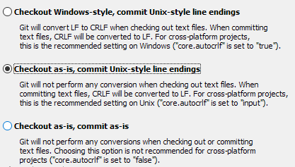
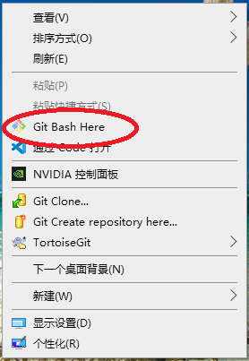
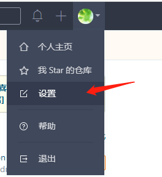
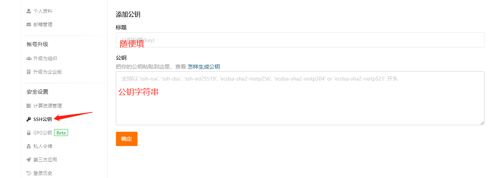
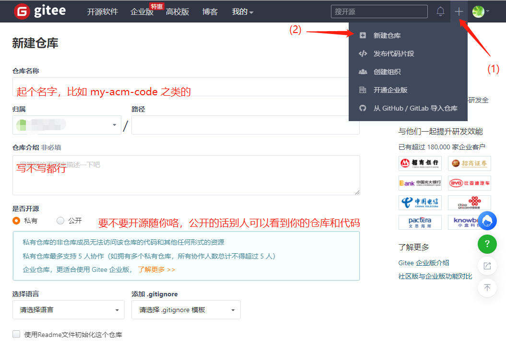
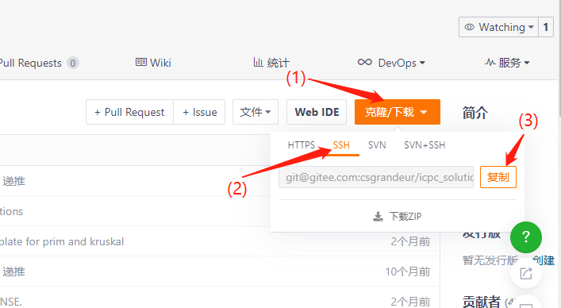
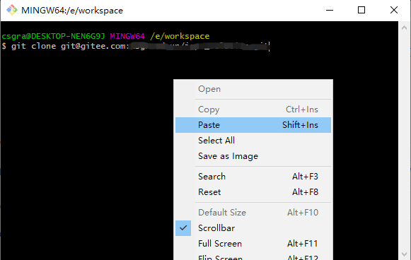

# 用git管理自己的代码与文档


## 什么是git

git（分布式版本控制系统）并不等同于github。

git是一个分布式版本控制软件，最初由林纳斯·托瓦兹创作，于2005年以GPL发布。

github提供git服务，其他网站当然也可以，自己也可以搭建git服务器。

今天改了代码，明天又改了，后天甲方爸爸说还是喜欢第一个版本……

用git可以方便的查看/回滚任意commit过的版本，并查看文本类文件的差异。

当然也可以当个文档云服务，方便地在不同地点同步自己的代码与文档。严格的版本控制能够保证文件不出差错。

**这里推荐大家使用git管理自己的ACM代码、解题报告、模板、技术日志等**。

## git起步

### 下载安装git客户端

当然要有支持软件才可以：https://git-scm.com/

安装的时候有个细节要注意选择——

“Checkout as-is, commit Unix-style line endings”



写代码的你们应该已经了解这个事情：Windows、OSX、Linux/Unix 的换行格式不一样（`\n`、`\r\n`...）

建议推送到git仓库的代码都是 Unix 格式的换行。

而Windows只要使用高级点的文本编辑器，换行显示都不是问题。

### 配置个人信息及公钥

安装git软件之后就有git控制台了，任意位置右键打开它。



执行以下三行，替换引号里的内容为自己的。遇到提示都默认回车。

```bash
git config --global user.name "<你的用户名>"
git config --global user.email "<你的邮箱>"
ssh-keygen -t rsa -C "<你的邮箱>"
```

对于新手小白，不用太关心这些是什么。特别是第三行以及下面的内容，如果想搞清楚，可以去了解一下[RSA加密算法](https://zh.wikipedia.org/wiki/RSA%E5%8A%A0%E5%AF%86%E6%BC%94%E7%AE%97%E6%B3%95)，简单来说是让你本地生成一个钥匙和一个锁，等下要把锁传给服务器用来锁你的代码。而钥匙只有你的本地有，能理解个大概吧。

github的网速慢，可能还需要梯子。对于新手的你，就用开源中国的git服务吧，很快也很好用：

https://gitee.com/

注册账号一通操作（认真对待账号邮箱与手机号。总忘密码不是快乐的事情）

进入账号设置，找到ssh公钥设置进行填写。





公钥字符串就是你的锁，它就是刚刚`ssh-keygen -t rsa -C "<你的邮箱>"`这行代码在你的系统里生成的：

```path
C:\Users\<你的windows用户名>\.ssh\id_rsa.pub
```

注意：这个目录有 `id_rsa` 和 `id_rsa.pub`，“pub”一看就能分辨这个才是“公”钥咯。

用vscode或者什么文本编辑器打开这个文件，复制全部内容，贴在gitee的那个地方，点确定，gitee就有你的锁（公钥）来保护你的代码了。

私钥不需要另外的配置，git软件会自动到这个路径找你的私钥去开锁帮你读写服务器上的代码。

### 已经可以开始使用了

在gitee里建一个自己的仓库



进入仓库，复制仓库的管理链接，我们配置的是ssh方式的（ssh一般基于RSA加密，就是上面的钥匙和锁的事情）



到自己本地的工作目录（就是自己想要存放、管理代码或文档的目录）

打开前面配置git的那个控制台（右键->git bash here），用git指令把代码克隆下来（当然新仓库啥都没有）



```bash
git clone <刚刚复制的ssh地址>
```

正常情况仓库就到了本地了，会有一个你仓库名字的文件夹，比如`my-acm-code`。文件夹里有一个隐藏文件夹“`.git`”，这就是你本地的仓库。

这里举个例子，仓库放在了这里：

```path
E:\workspace\my-acm-code
```

你的仓库就是隐藏文件夹

```path
E:\workspace\my-acm-code\.git
```

在仓库文件夹里（`E:\workspace\my-acm-code`）随便存放和编辑代码或文档吧。

当想要保存版本的时候，在你的仓库文件夹里（`E:\workspace\my-acm-code`）打开控制台。当然在控制台里切换到这个路径也可以。这可能需要一些基础的命令行知识，比如小学时候学的dos指令（windows下）或者了解过linux的shell指令。

```bash
git add .
```

可能什么都不发生，也可能有一些提示，这是把“还没加入版本控制的文件”加入到版本控制里。

然后

```bash
git commit -am "<你的备注>"
```

git要求你对每次commit的版本做个注释，这样方便你回忆这次commit了个什么。当然你可以胡乱填写。

如果不写这个引号的部分，那么git会为你进入一个vim编辑界面。有个梗是“如何得到一串随机字符串？——给一个小白进入vim，让他想办法退出”，那会更难受些，vim怎么用这里就不讲了，在自己了解vim编辑之前，乖乖把备注写在同一行里吧。

这行执行之后，你的代码版本就被保存在了本地仓库里了（就是隐藏的`.git`里）。

但是gitee的服务器并不知道，想享受git云服务，那还得把你本地的仓库推到服务器上去，就是

```bash
git push
```

好了，一次完整的版本管理操作完成了。看看gitee网站上仓库的内容，已经和自己本地一致了。

小小总结一下：

1. 下载安装git软件
1. git config 配置个人信息
1. ssh-keygen 生成私钥公钥（钥匙和锁）
1. 注册gitee账号，配置gitee公钥
1. 在gitee网页上建立自己的仓库
1. 在仓库里复制ssh地址
1. 本地git clone这个仓库
1. 编辑自己的代码/文档
1. `git add .`
1. `git commit -am "<你的备注>"`
1. `git push`

### 同步自己的仓库

换一台新电脑，当然还得 `git clone` ，这不用说了。

而在家里和宿舍两台电脑都有了仓库，得保持一致吧。

宿舍里 `git push` 了，回到家，仓库还是旧版本。

这时候用 `git pull`，把最新的仓库从 gitee 上拉下来。

然后就可以正常的继续自己的工作了。

### gitignore

仓库的目录下可以建一个`.gitignore`文件，里面描述不想加入版本控制的文件。

比如一个写代码的仓库，你经常会编译出 `main.exe` 文件，它不需要“云同步”，不需要版本控制，而且把它推到仓库里的话，还挺占空间。

我们在`.gitignore`里加上`*.exe`，这样无论怎样 add commit push，仓库里的`.exe`文件都会雷打不动地留在本地了。

想要有更丰富的`gitignore`方式，可以去了解一下[通配符](https://zh.wikipedia.org/wiki/%E9%80%9A%E9%85%8D%E7%AC%A6)以及`.gitignore`的写法。

## TortoiseGit

TortoiseGit是个帮助我们使用git的软件。

命令行恐惧症？可以额外装一个 TortoiseGit：https://tortoisegit.org/download/

它可以帮你用鼠标代替上面那些命令行操作，自己摸索吧。
